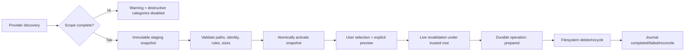

# Архітектурний і кодовий аудит GameTrimmer

**Дата:** 27 липня 2026 року  
**Об’єкт аудиту:** поточна робоча копія `GameTrimmer`  
**Гілка / базовий commit:** `master` / `05a667c`  
**Режим:** read-only щодо коду, конфігурації, ресурсів і наявних документів  
**Роль:** Lead Software Architect / Senior Rust & Windows Developer

> Проєкт на момент перевірки вже мав незакомічені зміни Claude Code. Аудит зроблено саме для поточного стану робочої копії; наявні зміни не редагувалися, не відкидалися й не форматувалися. Номери рядків можуть зміститися після подальшої паралельної роботи.

## 1. Резюме для ухвалення рішення

GameTrimmer має добрий інженерний фундамент: зрозумілий поділ на `core` і GUI-застосунок, сильну автоматичну тестову базу, чистий результат Clippy, ізоляцію багатьох Windows-специфічних деталей і продуману предметну модель. Поточний стан значно кращий за типовий прототип.

Проте **версію не варто випускати як production-ready інструмент із постійним видаленням**, доки не закрито два критичні ризики:

1. неповне читання Steam-маніфестів може перетворити живу гру на «сироту», яку типова конфігурація наперед позначить для постійного видалення;
2. шлях із БД використовується як безпосередній дозвіл на видалення без доведення, що ціль залишається всередині каталогу гри.

Додатково виявлено серйозні ризики зі старими кешованими результатами, частковими транзакціями сканування, скасуванням/закриттям під час операції, перебудовою БД і обробкою Windows junction/symlink.

### Підсумкова оцінка

| Напрям | Оцінка | Висновок |
|---|---:|---|
| Архітектурний фундамент | 7/10 | Правильний workspace-поділ, але orchestration-модулі надмірно великі |
| Якість Rust-коду | 8/10 | `fmt`, Clippy та тести чисті; є кілька небезпечних семантичних інваріантів |
| Безпека видалення | 4/10 | Два блокери релізу та кілька проблем узгодженості |
| Надійність даних/БД | 5/10 | WAL і тести добрі, але snapshot/rebuild протоколи недостатньо атомарні |
| Тестування | 8/10 | 565 тестів пройшли; бракує fault-injection і реальних Windows filesystem-тестів |
| Продуктивність | 7/10 | MFT і Rayon — сильні рішення; UI та discovery мають точки масштабування |
| Документація/UX | 6/10 | Документація змістовна, але вже розійшлася з кодом і упаковкою |
| Готовність до релізу | **умовно ні** | Після P0 + основних P1 може бути так |

## 2. Що саме перевірено

- структура workspace і межі між `crates/core` та `crates/app`;
- provider discovery, Steam/Itch/Humble/EA/Riot/Xbox та folder scan;
- звичайне сканування, MFT fast path, fallback і cancel flow;
- побудова findings, orphan detection і профілі автоматичного вибору;
- permanent/recycle-bin видалення, журнал операцій і очищення БД;
- SQLite schema, міграції, WAL, persistence, salvage/rebuild;
- UI-модель, план видалення, пошук, дерево, локалізація;
- правила, import/export, packaging, маніфест і README;
- залежності, компіляція всіх targets/features, форматування, Clippy і тести;
- стан Git до і після аудиту.

Кодова база містить приблизно **35 189 рядків Rust у 85 файлах**. Найбільші модулі:

| Файл | Приблизний розмір |
|---|---:|
| `crates/app/src/worker/scan.rs` | 3 044 рядки |
| `crates/app/src/model.rs` | 2 328 |
| `crates/core/src/db.rs` | 1 434 |
| `crates/app/src/app.rs` | 1 419 |
| `crates/app/src/ui/tree_view.rs` | 1 259 |
| `crates/core/src/mftscan/record.rs` | 1 053 |

## 3. Результати автоматичної перевірки

| Перевірка | Результат |
|---|---|
| `cargo fmt --all -- --check` | пройдено |
| `cargo clippy --workspace --all-targets --all-features --locked --offline -- -D warnings` | пройдено |
| `cargo test --workspace --all-targets --locked --offline` | **565 passed, 0 failed, 4 ignored** |
| `git diff --check` | пройдено |
| Future incompatibility report | попередження для `binrw 0.11.3` через `ntfs 0.4.0` |
| RustSec/advisory scan | не виконано: `cargo audit` у середовищі не встановлений |

Компіляція й тести виконувалися з окремим target-каталогом поза репозиторієм, тому не створили `target/` і не змінювали артефакти проєкту.

Важливе трактування: чисті Clippy і тести підтверджують технічну дисципліну, але не доводять безпечність продуктової політики. Декілька тестів прямо закріплюють ризиковану поточну поведінку — наприклад, збереження даних бібліотеки, яка зникла.

## 4. Реєстр знахідок

| ID | Пріоритет | Коротко | Наслідок |
|---|---|---|---|
| GT-001 | **P0** | Неповний Steam discovery створює хибну «сироту» | Видалення живої гри |
| GT-002 | **P0** | Немає containment-перевірки перед видаленням | Видалення поза каталогом гри |
| GT-003 | **P1** | Старі findings зниклої бібліотеки залишаються активними | Видалення за застарілим шляхом |
| GT-004 | **P1** | Будь-яка metadata-помилка вважається фактом видалення | Файл лишається, запис і UI зникають |
| GT-005 | **P1** | UI може отримати незафіксовані результати scan transaction | Розбіжність UI та БД |
| GT-006 | **P1** | Cancel/close руйнує або залишає частковий snapshot | Втрата останнього доброго стану |
| GT-007 | **P1** | Rebuild БД видаляє оригінал до успішної заміни | Втрата БД при проміжній помилці |
| GT-008 | **P1** | Немає коректної гілки для Windows directory links | Збій видалення junction/symlink |
| GT-009 | **P1** | Provider/scanner errors систематично ковтаються | «Успішний», але неповний scan |
| GT-010 | **P1** | Журнал оновлюється після фізичного видалення без recovery | Вічно pending/неузгоджений запис |
| GT-011 | **P1** | Повний перебір дисків може зависати на network/removable drive | Довгий startup/scan, неочікуваний SMB I/O |
| GT-012 | **P2** | «Видалити категорію» ігнорує ручне зняття прапорців | Неочікуване масове видалення |
| GT-013 | **P2** | Ідентифікація Recycle Bin nuke неточна | Хибний звіт про спосіб/обсяг видалення |
| GT-014 | **P2** | Import/export rule packs неатомарний | Частково записані правила |
| GT-015 | **P2** | Міграції й schema constraints недостатньо формалізовані | Тиха корупція/важке відновлення |
| GT-016 | **P2** | README, packaging і selection policy розійшлися | Помилкові очікування користувача |
| GT-017 | **P2** | Завеликі orchestration-модулі й stringly-typed cancellation | Висока ціна змін і регресій |
| GT-018 | **P2** | UI виконує зайві побудови/алокації на кадр | Просідання на великих наборах |
| GT-019 | **P2** | Запуск системних утиліт через PATH | Локальне executable hijacking |
| GT-020 | **P2** | Немає Windows CI і автоматичного advisory gate | Регресії виявляються запізно |

---

## 5. Критичні знахідки

### GT-001 — хибна Steam-сирота може бути наперед вибрана для постійного видалення

**Пріоритет:** P0, release blocker  
**Впевненість:** висока

Steam provider пропускає помилки читання каталогу, читання маніфесту та парсингу через `.ok()`, `.flatten()` і `filter_map`: [steam.rs:54-61](../../crates/core/src/providers/steam.rs#L54-L61). У результаті жива встановлена гра просто зникає зі списку керованих інсталяцій.

Далі orphan detection трактує некеровані підкаталоги `steamapps/common` як сироти: [orphans.rs:212-230](../../crates/core/src/orphans.rs#L212-L230). GUI відносить `Orphan` до safe-категорій і автоматично вибирає її у профілях Cautious, Balanced та Aggressive: [model.rs:326-338](../../crates/app/src/model.rs#L326-L338). Типовий профіль — Balanced, типовий спосіб — Permanent: [settings.rs:9-18](../../crates/core/src/settings.rs#L9-L18), [settings.rs:165-177](../../crates/core/src/settings.rs#L165-L177).

**Реальний сценарій:**

1. `appmanifest_*.acf` тимчасово заблокований антивірусом, частково записаний Steam або пошкоджений.
2. Provider мовчки не повертає гру.
3. Її каталог у `steamapps/common` стає «сиротою».
4. Balanced наперед ставить прапорець.
5. Користувач підтверджує сумарний діалог і постійно видаляє живу інсталяцію.

Ручно скопійована гра без маніфесту має той самий ризик. Це суперечить власному safety-принципу в [orphans.rs:24-33](../../crates/core/src/orphans.rs#L24-L33).

**Рекомендація:**

- повертати з provider не лише список, а `DiscoveryOutcome { items, completeness, warnings }`;
- якщо хоча б один Steam manifest не прочитано/не розібрано, вимкнути unmanaged-folder orphan detection для цієї бібліотеки;
- сервісні каталоги Steam і невідомі каталоги моделювати окремими підтипами;
- ніколи не auto-select невідомий unmanaged folder;
- до закриття P0 зробити Recycle Bin типовим способом видалення;
- у confirmation показувати конкретні orphan-шляхи, а не лише кількість і байти.

**Обов’язкові тести:** malformed manifest, `PermissionDenied`, manifest під час часткового запису, ручний каталог у `common`, бібліотека з одночасно валідними й невалідними маніфестами.

### GT-002 — шлях із БД не обмежений коренем гри

**Пріоритет:** P0, release blocker  
**Впевненість:** висока

GUI створює ціль через `install_dir.join(rel_path)`: [app.rs:752-760](../../crates/app/src/app.rs#L752-L760). До worker передаються вже готові `full_path`, без довіреного root або відносного шляху: [delete.rs:25-29](../../crates/app/src/worker/delete.rs#L25-L29). Core потім безпосередньо видаляє отриману ціль: [ops.rs:39-49](../../crates/core/src/ops.rs#L39-L49).

На Windows абсолютний `rel_path` може замінити base під час `join`, а компоненти `..` можуть вивести шлях за межі інсталяції. Пошкоджена, стара або вручну змінена БД таким чином стає не просто кешем, а повноваженням на видалення будь-якого доступного файлу.

**Рекомендація:**

- зберігати в `DeleteItem` довірений root, `file_id`, сирий відносний шлях і очікувану identity/metadata;
- відхиляти `RootDir`, `Prefix`, абсолютні шляхи та `ParentDir`;
- перед confirmation і вдруге безпосередньо у worker доводити, що ціль — нащадок захопленого root;
- коректно враховувати case-insensitive Windows paths, UNC, junction, symlink і reparse points;
- повторно звіряти запис БД, розмір та filesystem identity перед destructive call;
- не покладатися лише на текстову нормалізацію/canonicalize, яка може перейти через reparse point.

**Обов’язкові тести:** `..\`, абсолютний `C:\...`, UNC, інша літера диска, junction назовні, заміна файла між confirmation і execution, stale DB row.

## 6. Високопріоритетні проблеми

### GT-003 — застарілі findings бібліотеки залишаються активними

Тест прямо закріплює політику «бібліотека більше не знайдена — лишити без змін»: [scan.rs:2016-2071](../../crates/app/src/worker/scan.rs#L2016-L2071). Startup завантажує попередні findings без поняття active snapshot або offline library: [load.rs:102-110](../../crates/app/src/worker/load.rs#L102-L110), [app.rs:339-355](../../crates/app/src/app.rs#L339-L355).

Якщо диск від’єднали, provider тимчасово впав або літера диска перейшла іншому носію, старий шлях знову стає доступним для видалення — потенційно вже для іншого вмісту.

**Виправлення:** `scan_runs` + immutable snapshots; статус бібліотеки `active/offline/incomplete`; кешовані findings недоступні для видалення без live revalidation; окремо зберігати «останній добрий snapshot».

### GT-004 — будь-яка помилка `symlink_metadata` очищає запис

Після невдалого видалення запис вважається purgeable, якщо `symlink_metadata` повернув **будь-яку** помилку: [delete.rs:143-159](../../crates/app/src/worker/delete.rs#L143-L159). `PermissionDenied`, sharing violation або transient I/O — не доказ, що файл зник.

**Виправлення:** очищати записи лише при успішному видаленні або `ErrorKind::NotFound`; в усіх інших випадках залишати finding і показувати точну помилку.

### GT-005 — scan writer публікує результати до успішного commit

`flush_batch` додає findings до UI-масиву одразу після окремого `persist_prepared_game`, але до commit; помилка гри лише логується, а помилка commit теж не припиняє успішне завершення: [scan.rs:870-901](../../crates/app/src/worker/scan.rs#L870-L901).

Наслідки:

- UI показує рядки, яких немає в БД;
- частина невдалої гри може потрапити в transaction;
- після restart «успішні» результати зникають;
- occupancy, findings і журнали можуть не збігатися.

**Виправлення:** stage UI rows, publish лише після commit; savepoint на гру або atomic batch; persistence failure має робити scan incomplete/failed, а не лише записувати log.

### GT-006 — cancel і закриття застосунку не зберігають останній добрий стан

`persist_libraries` видаляє старі files/findings/games до завершення нового scan: [scan.rs:931-1005](../../crates/app/src/worker/scan.rs#L931-L1005). Після цього cancel може обірвати pipeline, залишивши часткову базу.

Окремо коментар каже, що `JoinHandle` буде joined on drop: [app.rs:113-115](../../crates/app/src/app.rs#L113-L115), але `std::thread::JoinHandle` при drop від’єднує thread; у коді немає відповідного `Drop`/`on_exit` shutdown protocol.

**Виправлення:** staging snapshot із activation лише після `Done`; cancel видаляє staging і зберігає активний snapshot; на закритті — cancel + bounded join для scan, заборона/підтвердження закриття під час delete/rebuild.

### GT-007 — rebuild БД спочатку видаляє оригінал

Після побудови temp DB код викликає `delete_database_files`, а лише потім `rename` temp-файла: [db.rs:435-473](../../crates/core/src/db.rs#L435-L473). Видалення починається з головного файла, sidecars ідуть після нього: [db.rs:480-485](../../crates/core/src/db.rs#L480-L485).

Помилка на WAL/SHM lock або на rename залишає користувача без основної БД. Крім того, salvage відкриває джерело через звичайний `open`, який може застосувати schema/migrations: [db.rs:499-509](../../crates/core/src/db.rs#L499-L509).

**Виправлення:** read-only salvage; checkpoint/close; перевірена temp DB; атомарна заміна через Windows `ReplaceFileW` або `original -> .bak`, `temp -> original`, rollback; fault-injection тести на кожній межі.

### GT-008 — directory symlink/junction не має коректної Windows-гілки

Видалення визначає каталог через `symlink_metadata().is_dir()`, інакше викликає `remove_file`: [ops.rs:39-49](../../crates/core/src/ops.rs#L39-L49). Для directory symlink/junction metadata описує сам link/reparse point, тому потрібне окреме визначення типу; поточна реалізація може не видалити посилання, хоча коментар обіцяє не переходити в target.

**Виправлення:** використати Windows reparse/file type API й окремо викликати видалення directory link; інтеграційно довести, що target лишається недоторканим.

### GT-009 — неповний discovery маскується як успішний

Окрім Steam, walker мовчки пропускає окремі помилки: [scanner.rs:102-108](../../crates/core/src/scanner.rs#L102-L108). Humble перетворює malformed JSON на порожній результат: [humble.rs:94-100](../../crates/core/src/providers/humble.rs#L94-L100). Itch пропускає помилки рядків через `flatten`: [itch.rs:57-96](../../crates/core/src/providers/itch.rs#L57-L96).

Це допустимо для best-effort інвентаризації, але не для destructive decision без ознаки completeness.

**Виправлення:** однакова модель outcome для всіх providers/scanners; видимий warning; destructive categories вимкнені для incomplete scope.

### GT-010 — файл видаляється раніше, ніж журнал гарантовано оновлено

Фізична операція відбувається до SQL update журналу: [ops.rs:125-145](../../crates/core/src/ops.rs#L125-L145). Якщо видалення успішне, а update через lock/disk-full завершується помилкою, UI бачить failure, але файл уже зник, а operation лишається pending.

**Виправлення:** durable state machine `prepared -> executing -> completed/failed/reconcile`; на startup звіряти pending operation з filesystem і завершувати журнал ідемпотентно.

### GT-011 — probing усіх літер дисків може зависнути

Folder scan перевіряє `A:\`–`Z:\` через звичайні filesystem calls: [folderscan.rs:64-84](../../crates/core/src/providers/folderscan.rs#L64-L84). Disconnected mapped drive або повільний removable/network volume може довго блокувати worker і спричинити неочікуваний SMB доступ.

**Виправлення:** `GetLogicalDrives` + `GetDriveTypeW`; за замовчуванням пропускати `DRIVE_REMOTE`, `NO_ROOT_DIR`, `UNKNOWN`; network drives — лише explicit opt-in; time-bounded probes.

## 7. Середньопріоритетні проблеми

### GT-012 — category action ігнорує ручний selection

Операція з plan card збирає всі не видалені елементи категорії, незалежно від checkbox: [app.rs:705-727](../../crates/app/src/app.rs#L705-L727). Confirmation показує лише кількість і сумарний обсяг: [dialogs.rs:91-149](../../crates/app/src/ui/dialogs.rs#L91-L149).

**Виправлення:** або дія працює лише з selected, або текст прямо каже «видалити всі, включно з N вручну знятими» і показує preview шляхів.

### GT-013 — визначення фактичного Recycle Bin результату ненадійне

Після операції код порівнює `PathBuf` з одним after-snapshot: [delete.rs:117-129](../../crates/app/src/worker/delete.rs#L117-L129), [delete.rs:201-212](../../crates/app/src/worker/delete.rs#L201-L212). Exact comparison не враховує Windows case/prefix normalization; старий recycled item із тим самим original path може маскувати новий permanent fallback.

**Виправлення:** before/after delta, стабільний item identity/час, Windows-normalized comparison; невизначений результат не називати підтвердженим.

### GT-014 — rule pack import/export частково атомарний

Код прямо дозволяє лишати вже імпортовані файли при помилці наступного: [rules_io.rs:34-40](../../crates/app/src/worker/rules_io.rs#L34-L40). Backup створюється, але target записується напряму: [rules_io.rs:83-126](../../crates/app/src/worker/rules_io.rs#L83-L126).

**Виправлення:** спочатку прочитати й валідувати весь набір; писати temp siblings, flush/sync, atomic replace; автоматичний rollback із backup.

### GT-015 — schema evolution і валідація даних

Міграції базуються переважно на probing колонок, без явного versioned registry. Значення з SQLite місцями приводяться до unsigned типів через `as`, зокрема при завантаженні findings: [load.rs:125-130](../../crates/app/src/worker/load.rs#L125-L130). У schema бракує сильних `CHECK`/uniqueness інваріантів для частини доменних значень.

**Виправлення:** `PRAGMA user_version` або таблиця migration registry; кожна міграція в transaction; `TryFrom`/range validation; `CHECK(size >= 0)`, confidence range, унікальність identity/relative path відповідно до доменної моделі.

Також `to_string_lossy` для filesystem paths варто замінити на явну Windows-compatible стратегію збереження або контрольовану відмову — інакше не-Unicode шлях уже не можна гарантовано відтворити.

### GT-016 — документація розійшлася з реалізацією

- README каже, що Cautious включає `redist`, але код і тести виключають Redist із safe selection: [README.md:68-71](../../README.md#L68-L71), [model.rs:326-338](../../crates/app/src/model.rs#L326-L338).
- README посилається на `.cargo/config.toml`, але файл відсутній: [README.md:203-204](../../README.md#L203-L204).
  - _Закрито 2026-08-03: README розділено на англійський і український, згадки не лишилося в жодному._
- Packaging-коментарі згадують `.cargo/config.toml` і `CLAUDE.md`, яких у поточній копії немає.
  - _Закрито 2026-08-03: коментарі в `scripts/package-portable.ps1` переписано — обхід прибрано ще 2026-07-24 (`6814264`), і `cargo metadata` там лишився з іншої, чинної причини._
- Маніфест описує Windows 10/11, але містить також GUID Windows 8.1: [gametrimmer.manifest:13-15](../../crates/app/assets/gametrimmer.manifest#L13-L15).
- Частина CLI/status/error текстів локалізована, частина жорстко зафіксована українською або англійською.

**Виправлення:** визначити selection policy як один versioned product contract; генерувати таблицю README з коду/тестового fixture; додати documentation/packaging smoke check.

### GT-017 — orchestration-модулі вже перевищили зручні межі

`scan.rs`, `model.rs`, `db.rs` та `app.rs` одночасно містять orchestration, persistence, presentation policy і recovery. Скасування визначається рядком `"cancelled"`: [scan.rs:838-839](../../crates/app/src/worker/scan.rs#L838-L839), що легко зламати зміною тексту.

**Рекомендований поділ:**

- `scan/{orchestrator, discovery, routing, persistence, snapshot, orphan_policy}.rs`;
- `db/{schema, migrations, repositories, rebuild, recovery}.rs`;
- `app/{state, reducer, jobs, shutdown}.rs`;
- `model/{tree, selection, plan, sort}.rs`;
- `CoreError::Cancelled` і структуровані worker events замість локалізованих рядків.

### GT-018 — зайва робота UI на кадр

Tree view може двічі будувати список visible rows за один кадр: [tree_view.rs:131-147](../../crates/app/src/ui/tree_view.rs#L131-L147). Sort comparator створює lowercase-рядки та клони під час порівнянь: [model.rs:595-612](../../crates/app/src/model.rs#L595-L612).

**Виправлення:** кеш visible rows із invalidation на filter/expand; попередньо обчислені normalized sort keys; benchmark на 100k/500k findings; debounce пошуку.

### GT-019 — системні програми запускаються через PATH

UI викликає `explorer.exe` і `rundll32.exe` за коротким ім’ям: [row_actions.rs:47-83](../../crates/app/src/ui/row_actions.rs#L47-L83). У portable/current-directory сценарії це створює зайву поверхню executable search-order hijacking.

**Виправлення:** Shell APIs або перевірений абсолютний шлях до `%SystemRoot%\System32`; аргументи передавати без shell.

### GT-020 — відсутній автоматичний release gate

У репозиторії немає CI workflow. Локальна перевірка сильна, але залежить від середовища розробника. Крім того, `binrw 0.11.3`, який приходить через `ntfs 0.4.0`, має future-incompatibility з новими Rust-компіляторами.

**Виправлення:** Windows CI з:

- `fmt --check`;
- Clippy `-D warnings`;
- workspace/all-targets tests;
- release build та packaging smoke;
- `cargo audit` або еквівалентний RustSec gate;
- license/dependency policy (`cargo-deny`);
- реальні junction/symlink/recycle-bin тести на Windows;
- перевірка executable manifest/resources і budget на розмір binary;
- окремий scheduled job із найновішим stable Rust.

Необхідно оновити/замінити `ntfs` або керовано patch-ити transitive `binrw`; просте приховування warning лише відкладе поломку.

## 8. Рекомендована цільова архітектура безпечного scan/delete

Найважливіша зміна — перестати трактувати поточні DB rows як достатній дозвіл на видалення.



### Ключові інваріанти

1. **Incomplete discovery ніколи не створює destructive inference.**
2. **Старий snapshot можна переглядати, але не виконувати без live revalidation.**
3. **Жоден DB path не видаляється без containment під довіреним root.**
4. **UI бачить лише committed scan rows.**
5. **Cancel зберігає останній активний добрий snapshot.**
6. **Кожна destructive operation відновлювана та ідемпотентно reconcile-иться.**
7. **Permanent не є типовим режимом до підтвердження safety maturity.**

## 9. Пріоритетний план робіт

### Етап 0 — негайний safety patch

1. Змінити типовий delete method на Recycle Bin.
2. Заборонити auto-select для unmanaged orphan folders.
3. Додати completeness flag і блок orphan detection при provider errors.
4. Додати подвійну containment/live identity перевірку.
5. Виправити purge лише на `NotFound`.

**Критерій виходу:** усі path-escape та malformed-manifest тести пройшли; жодна incomplete library не має executable destructive findings.

### Етап 1 — надійність scan/delete/DB

1. Snapshot schema і atomic activation.
2. Commit-before-publish у scan writer.
3. Cancel/shutdown protocol.
4. Durable operation state/reconciliation.
5. Atomic DB rebuild із recovery.
6. Реальні Windows junction/recycle-bin тести.

**Критерій виходу:** fault injection на commit, disk-full, lock, cancel і process shutdown не втрачає останній добрий snapshot і не створює невідомого стану операції.

### Етап 2 — контракт і підтримуваність

1. Versioned migrations і schema constraints.
2. Structured errors/events та єдина i18n-стратегія.
3. Розбиття великих модулів за ownership.
4. Atomic rules I/O.
5. Узгодження README, selection policy і packaging.
6. Windows CI + RustSec/dependency gates.

### Етап 3 — продуктивність і UX

1. Профілювання великих snapshots.
2. Кеш visible rows/sort keys і debounce пошуку.
3. Детальний destructive preview і зрозумілий partial-scan UX.
4. Measurement-driven pruning features/dependencies і binary-size budget.

## 10. Сильні сторони, які варто зберегти

- `core` не прив’язаний безпосередньо до egui, а застосунок має окремий worker layer.
- Велика кількість предметних unit/integration/golden tests.
- Clippy з `-D warnings` проходить для всіх targets/features.
- MFT fast path має fallback і захист від panic.
- Наявні operation journal, backup і salvage показують правильний напрямок, хоча протокол треба посилити.
- `--apply` у headless-потоці не виглядає випадково увімкненим.
- SQLite відкривається з foreign keys, busy timeout та WAL fallback.
- Rule packs і локалізація вже виділені в окремі підсистеми.
- У коді багато пояснень щодо Windows edge cases — це хороша база для формалізації інваріантів.

## 11. Обмеження цього аудиту

- Не запускалися destructive сценарії на реальних бібліотеках користувача.
- Не перевірялися реальні Steam/Epic/Xbox/Itch/Humble інсталяції та MFT на фізичному NTFS volume.
- Чотири ignored tests, зокрема інтеграції з реальною Recycle Bin/квотою, не виконувалися.
- RustSec advisory scan не виконано через відсутність `cargo-audit`; тому цей звіт **не стверджує**, що залежності не мають відомих CVE/advisories.
- Не проводилося GUI visual/usability тестування на різних DPI, мовах і accessibility settings.
- Аудит виконаний для незакоміченої робочої копії, яка могла продовжити змінюватися Claude Code після фіксації snapshot.

## 12. Контроль незмінності робочої копії

До аудиту зафіксовано такі наявні зміни:

```text
 M Cargo.lock
 M Cargo.toml
 M crates/app/assets/gametrimmer.manifest
 M crates/app/src/app.rs
 M crates/app/src/i18n/en.rs
 M crates/app/src/i18n/mod.rs
 M crates/app/src/i18n/uk.rs
 M crates/app/src/main.rs
 M crates/app/src/ui/libraries_panel.rs
 M crates/app/src/ui/plan_panel.rs
 M crates/app/src/ui/row_actions.rs
 M crates/app/src/ui/tree_view.rs
 M crates/app/src/worker/scan.rs
 M crates/core/examples/steam_smoke.rs
 M crates/core/src/providers/ea.rs
 M crates/core/src/providers/humble.rs
 M crates/core/src/providers/itch.rs
 M crates/core/src/providers/mod.rs
 M crates/core/src/providers/riot.rs
 M docs/portability-audit.md
?? crates/app/src/search.rs
```

Під час аудиту жоден із цих файлів не редагувався і не видалявся. Єдиний запланований новий файл у репозиторії — цей звіт: `docs/codebase-audit-2026-07-27.md`.

## 13. Фінальна рекомендація

**Go для подальшої розробки; No-Go для production-релізу з типовим Permanent delete.**

Найкраща коротка стратегія: спершу зробити систему fail-closed у discovery та path validation, потім перевести scan на immutable snapshots і довести recoverability операцій через fault-injection. Після цього поточна тестова дисципліна й архітектурна база дозволяють досить швидко довести GameTrimmer до надійного Windows-продукту.
