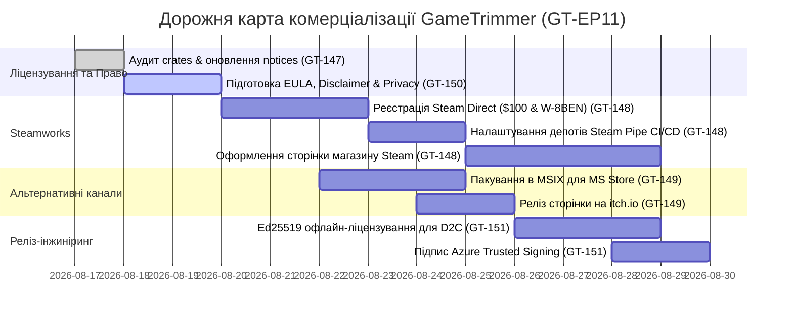

# Спайк GT-EP11: Комерціалізація, зміна ліцензії та дистрибуція GameTrimmer у Steam та на інших платформах

- **Дата дослідження:** 2026-08-17
- **Епік борди:** [GT-EP11 (id: 321)](http://127.0.0.1:3456) · «Комерціалізація, зміна ліцензії та дистрибуція у Steam і на інших платформах»
- **Пов'язані спайки:**
  - [GT-147 (id: 322)](http://127.0.0.1:3456) · «Аудит відкритого коду, залежностей та стратегія зміни ліцензії (MIT → Dual/Commercial/Open-Core)»
  - [GT-148 (id: 323)](http://127.0.0.1:3456) · «Публікація утиліти в Steam: Steam Direct, правила Valve, інтеграція Steamworks та Steam Pipe»
  - [GT-149 (id: 324)](http://127.0.0.1:3456) · «Дослідження альтернативних платформ дистрибуції (itch.io, Epic Games Store, GOG, Microsoft Store, D2C)»
  - [GT-150 (id: 325)](http://127.0.0.1:3456) · «Юридичний комплаєнс, EULA, товарні знаки та захист від ризиків»
  - [GT-151 (id: 326)](http://127.0.0.1:3456) · «Підпис коду (Code Signing), захист ліцензійних ключів та система оновлень»

---

## 1. Головний вердикт (Executive Summary)

1. **Ліцензійна чистота поточної кодової бази — 100% зелена:**
   - Поточний код GameTrimmer написано з нуля єдиним автором (GameTrimmer), що гарантує абсолютне володіння виключними майновими авторськими правами.
   - Усі 100% транзитивних Rust-залежностей у `Cargo.lock` (`rusqlite`, `windows`, `eframe`/`egui`, `rayon`, `zip`, `trash`, `dunce`, `ntfs`) мають суто пермісивні ліцензії (MIT, Apache-2.0, BSD-3-Clause, Public Domain/SQLite, zlib). **Copyleft-інфекцій (GPL/AGPL) у кодовій базі немає.**
   - Автор має повне законне право випускати майбутні версії під комерційною пропрієтарною ліцензією (або моделлю Dual-License / Open-Core).
2. **Публікація утиліти в Steam Store — повністю легітимна та стандартна практика:**
   - Утиліти для оптимізації та модифікації ігор є офіційним сегментом Steam (категорія *Software → Utilities / System Utilities*). Приклади успішних комерційних утиліт у Steam: *Lossless Scaling*, *Wallpaper Engine*, *DisplayFusion*, *Borderless Gaming*, *3DMark*.
   - Модифікація та очищення файлів у папках `steamapps/common` не порушує Steam Subscriber Agreement (SSA) за умови дотримання принципу **інформованої згоди користувача** (User-Initiated Action), відсутності бекдорів/малварі та наявності захисту від втручання в мультиплеєрні античити (Smart Anti-Cheat Shield).
3. **Рекомендована модель монетизації та ліцензування:**
   - **Модель продукту:** *Pay-Once, Own Forever* (одноразова покупка $4.99 – $9.99 у Steam / Microsoft Store / itch.io) без підписок та нав'язливого онлайну.
   - **Юридична модель коду:** **Open-Core** або **Dual-Licensing**. Базове ядро розпізнавання та видалення (`gametrimmer-core`) може залишатися під ліцензією MIT/FSL для залучення спільноти, тоді як релізний бінарник GameTrimmer з графічним інтерфейсом, модулями глибокої оптимізації монолітів (Wwise/UE/RE Engine) та інтеграцією зі Steamworks постачається під комерційною ліцензією **GameTrimmer Commercial EULA**.
4. **Багатоплатформний Roadmap (Фази релізу):**
   - **Фаза 1 (Ядро дистрибуції):** **Steam** (головний трафік і продажі) + **itch.io** (тестовий майданчик, інді-спільнота, $0 бар'єр) + **Microsoft Store** (миттєва довіра Windows SmartScreen без витрат на дорогі EV-сертифікати).
   - **Фаза 2 (Розширення):** **Epic Games Store** (Self-Publishing, 88/12) + **Прямі продажі на сайті (D2C)** через Lemon Squeezy / Paddle (Merchant of Record) + заявка на **GOG.com**.

---

## 2. Спайк GT-147: Правовий аудит кодової бази та зміна ліцензії

### 2.1. Поточний статус та правомірність зміни ліцензії
- **Поточна ліцензія:** MIT License (`LICENSE`, Copyright (c) 2024 GameTrimmer).
- **Право автора на переліцензування:** Згідно з міжнародним авторським правом (Бернська конвенція, закони США та України), автор і власник вихідного коду має необмежене право змінювати умови ліцензування для будь-яких **нових релізів та версій**. Попередні відкриті коміти залишаються під MIT, але нові комерційні білди, закриті модулі та наступні версії можуть поширюватися виключно за комерційною EULA.

### 2.2. Повний аудит Rust-залежностей (`Cargo.lock`)

| Пакет (Crate) | Версія | Ліцензія | Статус для комерційного продажу |
|---|---|---|---|
| `gametrimmer-core` | 1.0.0 | Власна розробка | 100% пропрієтарне право автора |
| `gametrimmer` (app) | 1.0.0 | Власна розробка | 100% пропрієтарне право автора |
| `rusqlite` | 0.40.1 | MIT / SQLite Public Domain | Дозволено (bundled SQLite не має copyleft) |
| `windows` | 0.62.2 | MIT / Apache-2.0 | Дозволено (офіційні біндінги Microsoft Win32) |
| `eframe` / `egui` | 0.35.0 | MIT / Apache-2.0 | Дозволено (UI-фреймворк повністю вільний) |
| `rayon` | 1.12.0 | MIT / Apache-2.0 | Дозволено (паралельний пул потоків) |
| `ntfs` | git (rev 9359c7a) | MIT / Apache-2.0 | Дозволено (чистий парсер MFT) |
| `zip` | 8.6.0 | MIT | Дозволено (deflate flate2 zlib-rs) |
| `trash` | 5.2.6 | MIT | Дозволено (Win32 IFileOperation / Recycle Bin) |
| `image` | 0.25.10 | MIT / Apache-2.0 | Дозволено (декодування PNG іконок) |
| `serde` / `serde_json`| 1.0 | MIT / Apache-2.0 | Дозволено |
| `dunce` | 1.0.5 | CC0-1.0 / Apache-2.0 / MIT | Дозволено (нормалізація шляхів Windows UNC) |
| `winreg` | 0.56.0 | MIT | Дозволено (читання реєстру Windows) |
| `chrono` | 0.4.45 | MIT / Apache-2.0 | Дозволено |
| `thiserror` | 2.0.18 | MIT / Apache-2.0 | Дозволено |
| `uuid` | 1.x | MIT / Apache-2.0 | Дозволено |

> [!NOTE]
> **Висновок аудиту:** Жодна залежність не містить ліцензій сімейства GPL, AGPL, LGPL (з вимогами динамічного зв'язування) або SSPL. Проект є на 100% ліцензійно чистим і готовим до комерційної дистрибуції.

### 2.3. Політика контриб'юцій: CLA та DCO
Щоб уникнути ситуації, коли сторонній контриб'ютор володіє авторськими правами на частину коду і блокує комерціалізацію:
1. **Впровадження Contributor License Agreement (CLA)** або **Developer Certificate of Origin (DCO):**
   - У `CONTRIBUTING.md` додається обов'язкова умова: будь-який Pull Request передає розробнику проекту невиключну, безвідкличну, безоплатну ліцензію на використання, переліцензування та комерційне поширення внесеного коду.
2. **Third-Party Notices:**
   - Файл `THIRD-PARTY-NOTICES.md` зберігається у фінальному дистрибутиві (містить копію ліцензії TikiOne Steam Cleaner та зведені копії MIT/Apache-2.0 ліцензій бібліотек).

---

## 3. Спайк GT-148: Вихід утиліти в Steam (Steam Direct)

### 3.1. Організаційні та фінансові вимоги Steamworks
1. **Steam Direct Fee:**
   - Вартість публікації одного застосунку: **$100 USD** (сплачується через Steamworks).
   - Сума повертається у повному обсязі після того, як застосунок згенерує понад $1,000 USD валового доходу.
2. **Податковий комплаєнс (W-8BEN / W-8BEN-E):**
   - Податкове інтерв'ю проходить онлайн у кабінеті Steamworks.
   - Для розробників з України діє двостороння міжурядова угода про уникнення подвійного оподаткування (US-Ukraine Tax Treaty). При зазначенні українського РНОКПП (TIN) ставка утримання податку біля джерела в США (US Withholding Tax) на авторські винагороди становить **10%** (або 0% залежно від категорії доходу).
3. **Банківські виплати:**
   - Щомісячні виплати від Valve Corporation здійснюються за системою SWIFT/Wire Transfer на валютний рахунок (USD/EUR) розробника (наприклад, ФОП у ПриватБанк / Монобанк). Мінімальний поріг виплати — $100.

### 3.2. Легітимність утиліт та модифікації директорій ігор у Steam
1. **Позиція Valve щодо сторонніх утиліт:**
   - Steam активно підтримує категорію *Software / Utilities*. У магазині успішно продаються десятки програм, що взаємодіють з іншими іграми, модифікують конфіги, керують вікнами чи видаляють кеш.
2. **Критерії відповідності Steam Distribution Agreement (SDA):**
   - **Недеструктивність та передбачуваність:** Програма не повинна діяти у фоні як вірус чи шкідливе ПЗ. Будь-яке видалення виконується за згодою користувача.
   - **Відсутність втручання в акаунти та Steam Auth:** GameTrimmer не перехоплює паролі, токени авторизації чи платіжні дані.
   - **Захист від античитів (Anti-Cheat Shield):** GameTrimmer захищає мультиплеєрні ігри з VAC, Easy Anti-Cheat та BattlEye від випадкової модифікації системних файлів.

### 3.3. Технічна інтеграція Steamworks API (`steamworks-rs`)
1. **Чи обов'язковий Steam DRM?**
   - **Ні.** Valve не вимагає обов'язкового накладання DRM. Розробник може вирішити:
     - *Варіант А (Steam-integrated):* Використання `steamworks-rs` для перевірки факту володіння грою (`SteamApps()->BIsSubscribedApp()`), інтеграції зі Steam Cloud (збереження пресетів), Steam Achievements («Звільнено перші 100 ГБ») та лічильника часу в утиліті.
     - *Варіант Б (DRM-Free на Steam):* Бінарник запускається навіть якщо клієнт Steam вимкнено (користувачі Steam надзвичайно цінують такий підхід для системних утиліт).
2. **Steam Pipe & CI/CD Автоматизація:**
   - Налаштування Steam Pipe SDK (`builder.exe`) у GitHub Actions.
   - Автоматичний деплой білдів на бета-гілку `nightly` при створенні релізного тегу в Git, та переведення в `default` (production) після проходження смоук-тестів.

---

## 4. Спайк GT-149: Дослідження альтернативних платформ дистрибуції

### 4.1. Порівняльна матриця платформ

| Платформа | Вхідний поріг | Комісія | Аудиторія & Тип | SmartScreen довіра | Пріоритет |
|---|---|---|---|---|---|
| **Steam Store** | $100 (поворотні) | 30% (70/30) | Масова геймерська (130M+ активних) | Висока (з часом / підписом) | **Tier 1 (Основний)** |
| **Microsoft Store** | $19 (фізособа) / $99 | 15% (або 0% для утиліт з D2C) | Windows 10/11 користувачі | **Миттєва 100% довіра** | **Tier 1 (Швидкий старт)** |
| **itch.io** | $0 | 10% (гнучка 0–100%) | Інді-геймери, ентузіасти, гіки | Потребує Code Signing | **Tier 1 (Early Access)** |
| **Epic Games Store** | $100 | 12% (88/12) | Геймери EGS (Fortnite, Unreal) | Потребує Code Signing | **Tier 2 (Після Steam)** |
| **D2C (Lemon Squeezy / Paddle)** | $0 | 5% + $0.50 | Прямий трафік з сайту / GitHub | Потребує Code Signing | **Tier 2 (Власний сайт)** |
| **GOG.com** | $0 (кураторська) | 30% | Шанувальники класики & DRM-Free | Потребує Code Signing | **Tier 3 (За заявкою)** |

### 4.2. Аналіз ключових переваг кожної платформи
1. **Microsoft Store:**
   - **Головна суперсила:** Застосунки, опубліковані через Microsoft Partner Center (MSIX пакунки), отримують **автоматичну верифікацію Windows SmartScreen** і ніколи не викликають синіх вікон попередження Defender («Windows protected your PC»). Це знімає потребу негайно купувати дорогі EV-сертифікати на старті.
2. **itch.io:**
   - Ідеальний майданчик для фази технічного тестування та залучення перших платоспроможних користувачів. Інструмент `butler` дозволяє оновлювати білди однією командою з консолі.
3. **Прямі продажі (D2C) через Merchant of Record (Lemon Squeezy / Paddle):**
   - Платформа бере на себе податкову звітність і сплату ПДВ (VAT/GST) у 100+ країнах. Покупець отримує ліцензійний ключ для автономного розблокування програми.

---

## 5. Спайк GT-150: Юридичний комплаєнс, EULA та товарні знаки

### 5.1. EULA та Умови використання (Terms of Service)
Юридичний захист будується на трьох обов'язкових стовпах:
1. **AS-IS Disclaimer (Відмова від прямих і непрямих гарантій):**
   - «Програмне забезпечення надається за принципом "ЯК Є" (AS-IS). Розробник не несе відповідальності за будь-які прямі, непрямі чи випадкові збитки, включаючи втрату даних, пошкодження файлів ігор, порушення роботи операційної системи або санкції з боку третіх платформ.»
2. **Принцип інформованої згоди користувача (User-Driven Action):**
   - GameTrimmer виступає виключно інструментом аналізу. Остаточне рішення щодо видалення файлів або застосування пресетів ухвалює виключно кінцевий користувач.
3. **Захист від античитів (Anti-Cheat Disclaimer):**
   - Чітке попередження: утиліта не призначена для отримання нечесної переваги в мультиплеєрі (не є чітом або трейнером).

### 5.2. Товарні знаки та брендинг (Nominative Fair Use)
- **Принцип Nominative Fair Use:** Закон дозволяє використовувати назви та логотипи сторонніх продуктів (Steam, Epic Games, Ubisoft Connect, EA app, Riot Games, назви ігор) **виключно для позначення сумісності та функціонального призначення** (наприклад: *«Підтримує бібліотеки Steam та Epic Games Store»*).
- **Вимоги комплаєнсу:**
  - Заборонено створювати враження, ніби GameTrimmer розроблено, схвалено чи сертифіковано компаніями Valve Corp. або Epic Games Inc.
  - В інтерфейсі (вікно *About*) та на сторінках магазинів обов'язково розміщується стандартний дисклеймер:
    > *«All product names, logos, and brands are property of their respective owners. Steam is a registered trademark of Valve Corporation. Epic Games is a trademark of Epic Games, Inc. GameTrimmer is an independent software tool and is not affiliated with, authorized, maintained, sponsored, or endorsed by Valve Corporation, Epic Games, or any of their affiliates.»*

### 5.3. Організаційно-правова форма (Україна)
- **ФОП 3-тя група (єдиний податок 5%):**
  - Оптимальна форма для розробника в Україні.
  - **КВЕД 62.01** (Комп'ютерне програмування), **58.29** (Видання іншого програмного забезпечення), **62.02** (Консультування з питань інформатизації).
  - Зовнішньоекономічні договори (Steam Distribution Agreement, EGS Distribution Agreement, Lemon Squeezy Merchant Agreement) є публічними офертами, виплати приймаються на валютний рахунок ФОП за інвойсами згідно з Законом України № 4496 (спрощений експорт послуг).

---

## 6. Спайк GT-151: Технічний реліз-інжиніринг та захист

### 6.1. Підпис коду (Code Signing)
1. **Проблема:** Непідписані бінарники Windows блокує фільтром SmartScreen («Невідомий видавець»).
2. **Варіанти вирішення:**
   - **Microsoft Store (MSIX):** Не потребує окремого сертифіката; Microsoft підписує пакунок власним сертифікатом магазину.
   - **Microsoft Azure Trusted Signing (раніше Azure Code Signing):** Найбільш сучасне та доступне рішення для розробників (~$10/місяць), що інтегрується з GitHub Actions і забезпечує миттєву репутацію в SmartScreen.
   - **Standard / EV Code Signing (Certum / Sectigo):** Апаратний або хмарний сертифікат для підпису standalone `.exe` інсталяторів.

### 6.2. Криптографічний механізм автономних ліцензійних ключів (Ed25519)
Для версій, що продаються поза межами Steam (D2C, itch.io):
- **Схема:** Асиметричний цифровий підпис Ed25519.
- **Принцип роботи:**
  1. Платіжний шлюз генерує ліцензійний файл/ключ, підписаний приватним ключем розробника (містить Email користувача, дату покупки, рівень ліцензії Pro).
  2. GameTrimmer містить зашитий публічний ключ і миттєво валідує ліцензію **на 100% офлайн** без звернення до будь-яких серверів активації.
  3. Відсутність DRM-драйверів, відсутність постійного онлайну — максимальна повага до приватності та автономності користувача.

---

## 7. Дорожня карта виконання (Action Items)

