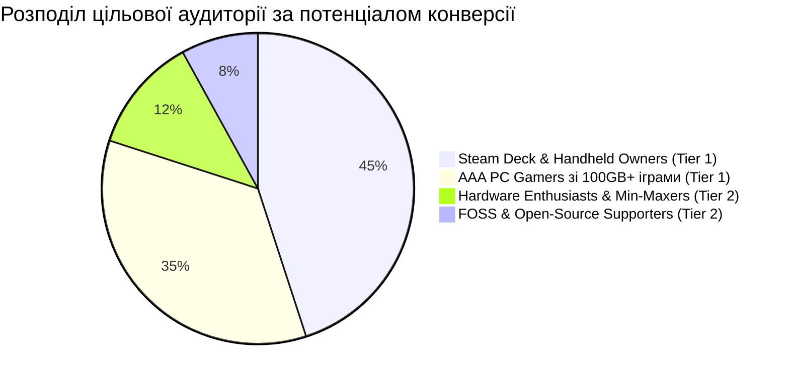
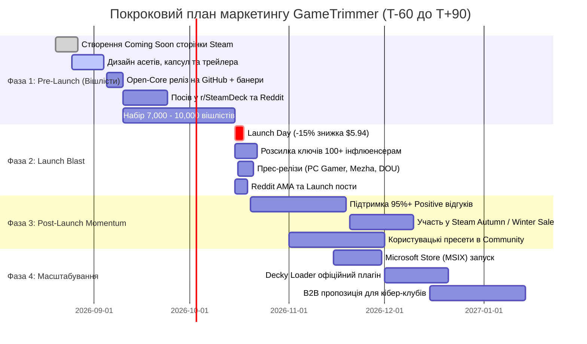

# GT-157: Покроковий маркетинговий план запуску та просування GameTrimmer у Steam
## Комплексна Go-To-Market стратегія для рекомендованої моделі «Pay-Once Premium $6.99 + Open-Core»

- **Дата розробки:** 18 серпня 2026 року
- **Картка на борді:** [GT-157 (id: 335)](http://127.0.0.1:3456) · «Покроковий маркетинговий план запуску та просування GameTrimmer у Steam (Go-To-Market Strategy)»
- **Батьківський епік:** [GT-EP11 (id: 321)](http://127.0.0.1:3456) · «Комерціалізація, зміна ліцензії та дистрибуція у Steam і на інших платформах»
- **Рекомендована модель:** Pay-Once Premium ($6.99) у Steam з відкритим базовим ядром на GitHub (`Open-Core / Dual-Licensing`) та розширенням на Microsoft Store (MSIX).

---

## 1. Executive Summary & Позиціонування (USP)

### 1.1. Продукт і Проблема
Сучасні комп'ютерні ігри досягли гігантських розмірів: *Baldur's Gate 3* (~150 GB), *Call of Duty: Warzone* (~175 GB), *S.T.A.L.K.E.R. 2* (~160 GB), *Star Wars Jedi: Survivor* (~130 GB), *Final Fantasy VII Rebirth* (~150 GB). 
Гравці постійно зіштовхуються з дефіцитом простору на швидких NVMe SSD та портативних ПК (Steam Deck, ROG Ally, Legion Go на 512GB/1TB).

**GameTrimmer** вирішує цю проблему без необхідності видаляти самі ігри, безпечно вивільняючи від 30 до 120+ GB пам'яті через:
1. Дедуплікацію однакових важких файлів (NTFS Hardlinks).
2. Очищення баластних невикористовуваних озвучок, мовних пакетів та 4K відео катсцен.
3. Видалення накопичених редистів, драйверів, кешів шейдерів та краш-дампів.
4. Глибоке проріджування монолітних архівів без порушення цілісності гри.

### 1.2. Унікальна торгова пропозиція (УТП)
> **Головний слоган:** *«Reclaim 50–100+ GB on your SSD without uninstalling your favourite games or risking anti-cheat bans.»*

| Ключова перевага | Чому це перемагає конкурентів (WizTree, CCleaner, CompactGUI) |
|---|---|
| **100% Native Rust Speed** | Запуск за 20 мс, сканування бібліотеки з 50 ігор за 3–5 секунд без споживання оперативної пам'яті (0% Electron bloat). |
| **100% Anti-Cheat & VAC Safe** | Нульове втручання у виконувані файли, пам'ять процесів або захищені мультиплеєрні пакети. Робота лише з пасивним баластом. |
| **Steam Deck & Handheld First** | Нативний Linux/SteamOS білд, сумісність з геймпадом, збереження ресурсу eMMC/MicroSD/NVMe накопичувачів. |
| **No-Subscription Fair Pricing** | Одноразова покупка $6.99 (з регіональними знижками). Нуль телеметрії, нуль реклами, повна робота офлайн. |

---

## 2. Цільові сегменти аудиторії (Buyer Personas)



1. **Persona 1: Власники Steam Deck та портативок (45% фокусу)**
   - *Біль:* Внутрішній накопичувач 256GB–512GB забивається 2–3 сучасними іграми. Дорогі 2TB 2230 SSD або повільні MicroSD карти.
   - *Тригер покупки:* Можливість встановити ще одну гру на Deck без видалення попередньої.
   - *Канали:* r/SteamDeck, SteamDeckHQ, Deckverse, GamingOnLinux, YouTube канали про Deck.

2. **Persona 2: Активні ПК-геймери з великими бібліотеками (35% фокусу)**
   - *Біль:* 1TB–2TB SSD заповнений «під зав'язку». Не хочеться видаляти ігри, бо перекачування 100GB займає години або є лімітований інтернет.
   - *Тригер покупки:* Швидке автоматичне очищення 80GB одним кліком перед установкою нового релізу.
   - *Канали:* r/pcgaming, r/pcmasterrace, Steam Community, Steam Reviews.

3. **Persona 3: Hardware ентузіасти та оптимізатори (12% фокусу)**
   - *Біль:* Роздратування від того, що розробники пакують по 40GB невикористовуваних мов (німецька, французька, японська озвучки) та дублікати файлів.
   - *Тригер покупки:* Контроль над кожним байтом ігрових папок, естетика нативного та швидкого Rust софту.
   - *Канали:* r/lowendgaming, LTT Forum, Guru3D, Overclockers.

4. **Persona 4: Прихильники Open-Source & Privacy (8% фокусу)**
   - *Біль:* Недовіра до пропрієтарних утиліт з рекламою та збором телеметрії (CCleaner тощо).
   - *Тригер покупки:* Повага до відкритого ядра на GitHub (`gametrimmer-core`), бажання підтримати незалежного автора.
   - *Канали:* GitHub, Hacker News, r/rust, Reddit FOSS.

---

## 3. Покроковий Go-To-Market план (4 Фази)



---

### Фаза 1: Передрелізний прогрів та генератор вішлістів (T-60 ... T-0 днів)
**Головна мета:** Набрати **7,000 – 10,000+ якісних вішлістів** перед днем релізу, що гарантує потрапляння в алгоритмічні списки Steam *«Popular Upcoming»* та *«New & Trending»*.

#### 1.1. Оптимізація сторінки магазину Steam (Store Page Conversion)
* **Капсульний дизайн (Header, Small, Main Capsule):** Контрастна графіка із зображенням ігрового накопичувача та виразним прогрес-баром вивільненого місця.
* **Трейлер (45–60 сек):**
  - *0-5 сек:* Проблема (червона смужка диска "SSD 99% Full", повідомлення Steam "Not enough disk space").
  - *5-20 сек:* Запуск GameTrimmer, миттєве сканування, показ знайденого баласту.
  - *20-40 сек:* Один клік → зелений статус «+84.6 GB Free» без пошкодження файлів.
  - *40-60 сек:* Демонстрація безпеки (Anti-Cheat Safe), підтримка Steam Deck, ціна $6.99.
* **Візуальні GIF-демонстрації в описі:**
  - `Baldur's Gate 3`: -24.2 GB (невикористовувані локалізації).
  - `Cyberpunk 2077`: -18.5 GB (дублікати та кеші).
  - `Call of Duty`: -35.0 GB (редисти та неактивні кампанії).
* **Бейдж довіри:** Окремий блок *«🛡️ 100% Anti-Cheat & VAC Safe Guarantee»*.

#### 1.2. Open-Core та Community Engine
* Публікація безкоштовного консольного ядра `gametrimmer-core` на GitHub.
* У термінальному виводі та README розміщується акуратний CTA:
  ```text
  ✨ Enjoying GameTrimmer CLI? 
  Get the 1-Click GUI with Steam Deck support & automated game presets on Steam:
  👉 [Wishlist GameTrimmer on Steam](https://store.steampowered.com/app/XXXXXX)
  ```

#### 1.3. Органічний посів та робота зі спільнотами (Grassroots Growth)
* **Reddit стратегия:**
  - Публікація корисного аналітичного посту в `r/SteamDeck` та `r/pcgaming`: *«We analyzed the top 50 AAA games on Steam: here is how much useless duplicate data and unneeded language audio they secretly install (and how to reclaim 500GB)»*.
  - Чесне позиціонування автора-розробника без нав'язливого спаму.
* **Співпраця з профільними порталами:**
  - Ексклюзивний ранній доступ для авторів *SteamDeckHQ*, *GamingOnLinux*, *Deckverse*, *Overkill.wtf*.

#### 1.4. Гейміфікація вішлістів (Wishlist Milestones)
* Публічне оголошення цілей у спільноті:
  - **3,000 Wishlists:** Релізна знижка 15% для всіх.
  - **7,000 Wishlists:** Додавання пресетів для 30 додаткових ретро- та JRPG-ігор на старті.
  - **12,000 Wishlists:** Розробка безкоштовного плагіна для Decky Loader.

---

### Фаза 2: Релізний вибух та конверсія (T-0 ... T+14 днів)
**Головна мета:** Максимізувати продажі у перший тиждень, активувати розсилку Steam Wishlist Notifications, потрапити в топ продажів серед утиліт та закріпитися в алгоритмах.

#### 2.1. Ціноутворення та релізний запуск
* **Базова ціна:** $6.99 (регіональні ціни за шкалою Valve: ~199₴ для України, €6.89 для ЄС).
* **Launch Discount:** **-15% ($5.94 / 169₴)** на перші 14 днів.
* Очікувана конверсія вішлістів за перші 72 години: **18–22%** (при 8,000 вішлістів це 1,440–1,760 миттєвих продажів).

#### 2.2. Інфлюенсер-кампанія та огляди
* Розсилка 100+ персоналізованих ключів авторам YouTube/TikTok заздалегідь під ембарго до дня релізу:
  - Категорія A: Steam Deck та портативні ПК (канали з 10k–200k підписників).
  - Категорія B: Оптимізація ПК, бюджетний геймінг, тести заліза.
* Готові привабливі теми для контент-мейкерів:
  - *«This $6 app doubled the storage of my Steam Deck»*
  - *«Stop uninstalling games! GameTrimmer reclaimed 100GB on my SSD»*
  - *«Is your SSD full? Here's the safest tool to clean AAA game bloat»*

#### 2.3. Медіа-висвітлення та прес-релізи
* **Західні медіа:** PC Gamer, Wccftech, Tom's Hardware, Rock Paper Shotgun, TechPowerUp.
* **Українські технологічні медіа:** Mezha.Media, ITC.ua, DOU, GameDev DOU (фокус на українського інді-розробника, Rust-стек та оптимізацію).

#### 2.4. Внутрішньопрограмний віральний цикл (Viral Space-Saved Card)
* Після завершення операції очищення в інтерфейсі відображається красива підсумкова картка:
  ```
  ┌─────────────────────────────────────────────────────────┐
  │  🎮 GAMETRIMMER REPORT                                  │
  │  Storage Reclaimed: 78.4 GB                             │
  │  Games Optimized: 12 (Baldur's Gate 3, CoD, Cyberpunk)   │
  │  Time Elapsed: 4.2 seconds                              │
  │  [ Share on X / Reddit ]   [ Copy Image to Clipboard ]   │
  └─────────────────────────────────────────────────────────┘
  ```
* Генерація зображення одним кліком стимулює користувачів хвалитися результатом у Discord, Reddit та X/Twitter, створюючи органічний безкоштовний K-factor віральності (>0.25).

---

### Фаза 3: Пострелізний імпульс та Steam алгоритми (T+15 ... T+90 днів)
**Головна мета:** Утримати рейтинг 95%+ («Overwhelmingly Positive»), максимізувати дохід на сезонних розпродажах та вибудувати довгострокову лояльність.

#### 3.1. Управління відгуками та підтримка
* **Правило 24 годин:** Розробник особисто відповідає на 100% негативних або проблемних відгуків у Steam з інструкцією вирішення.
* **Швидкі патчі:** Критичні виправлення нових ігор випускаються протягом 24–48 годин.
* Високий рейтинг 95%+ дає максимальний пріоритет у розділі *«More Like This»* на сторінках суміжних популярних ігор та утиліт (*Lossless Scaling*, *Wallpaper Engine*).

#### 3.2. Сезонні розпродажі (Seasonal Steam Sales)
* Участь у найближчому великому розпродажі Steam (Spring/Summer/Autumn/Winter Sale) зі знижкою **20%–25% ($5.24 – $5.59)**.
* Кожен розпродаж оновлює приплив нових покупців, які придбали нові ігри та знову зіткнулися з нестачею пам'яті.

#### 3.3. Користувацькі пресети та Community Hub
* Запуск системи шарингу користувацьких правил для нових ігор.
* Регулярні щотижневі апдейти бази ігор у новинах Steam: *«Update 1.2: Added optimization recipes for 15 new games (STALKER 2, Dragon Age, Space Marine 2)»*.

---

### Фаза 4: Мультиплатформне масштабування та B2B (3–12 місяців)
**Головна мета:** Охопити користувачів поза Steam та створити додаткові джерела прибутку.

1. **Microsoft Store (MSIX):**
   - Публікація в MS Store залучає аудиторію *PC Game Pass*, де проблема розміру ігор стоїть найгостріше через захищені UWP каталоги.
   - Органічний трафік з пошуку Windows та магазину Microsoft без додаткових витрат на рекламу.

2. **Офіційний плагін Decky Loader для SteamOS:**
   - Безкоштовний плагін-компаньйон у магазині Decky Loader, що інтегрується з купленою версією GameTrimmer у Steam.
   - Забезпечує домінування на платформі Steam Deck.

3. **B2B ліцензії для Комп'ютерних Клубів та Кібер-арен:**
   - Пакетна пропозиція для локальних мереж клубів (10–50 ПК) для автоматизованого стиснення сховищ серверів та клієнтських машин.
   - Вартість: $50–$150 на клуб/рік.

---

## 4. Бюджет та економіка маркетингу (Bootstrap-модель)

| Стаття витрат | Опис | Орієнтовна вартість |
|---|---|---|
| **Steam Direct Fee** | Одноразовий внесок Valve (повертається після $1,000 виручки) | $100 |
| **Графічні асети** | Steam Capsules, логотип, іконки, банери (Canva Pro / фріланс) | $100 – $200 |
| **Відео-трейлер** | Запис демо, монтаж, саунд-дизайн | $0 – $150 (інхаус) |
| **Azure Trusted Signing** | Сертифікат підпису коду | $10 / міс |
| **Ключі для блогерів/преси** | 100 промо-ключів у Steamworks | $0 (безкоштовно) |
| **Платна реклама (Reddit Ads)** | Тестовий запуск на r/SteamDeck під час релізу (опціонально) | $150 – $300 |
| **РАЗОМ стартовий бюджет:** | **Мінімальні інвестиції з ROI > 1000%** | **~$350 – $750** |

---

## 5. Маркетингові KPI та воронка конверсії

```
┌────────────────────────────────────────────────────────┐
│               МАРКЕТИНГОВА ВОРОНКА РЕЛІЗУ              │
├──────────────────────────────────────┬─────────────────┤
│ Показники сторінки Steam (Impressions)│ 500,000+        │
│ Переходи на сторінку (Store CTR)     │ ~6.5% (32,500)  │
│ Вішлісти до релізу (Wishlists)       │ 8,000 – 10,000  │
│ Конверсія вішлістів у 1-й тиждень    │ 20% (1,800 шт)  │
│ Органічні продажі 1-го місяця        │ 4,500 – 6,000   │
│ Загальні продажі за 1-й рік (Базовий)│ 25,000 копій    │
│ Чистий прибуток на рахунок ФОП       │ $66,750 (~2.77M)│
└──────────────────────────────────────┴─────────────────┘
```

---

## 6. Готові шаблони для аутрічу та спільнот

### Шаблон 6.1: Pitch Email для YouTube/TikTok техноблогерів
```text
Subject: Review Copy: GameTrimmer – Native Rust tool that reclaims 50-100GB on Steam Deck & PC

Hi [Creator Name],

I've been watching your recent videos on Steam Deck optimizations and PC storage setups, and I love how practical your content is.

I'm the developer of GameTrimmer, a lightweight, native Rust utility built to solve a huge pain point for gamers: modern AAA games taking 150GB+ of storage. 

Unlike general disk cleaners, GameTrimmer specializes in game-specific bloat:
• Safely deduplicates identical heavy files via NTFS hardlinks
• Trims unneeded language voiceover packs (saves 20-30GB on titles like Baldur's Gate 3)
• Cleans orphaned shader caches, video cutscenes, and redistributables
• 100% Anti-Cheat / VAC safe (zero memory modification, zero exe alterations)

I'd love to provide you with a Steam review key so you can test it on your own library:
Steam Key: [XXXXX-XXXXX-XXXXX]
Press Kit & High-Res Assets: [Link]

Would you be interested in taking a look or sharing your thoughts?

Best regards,
[Your Name] / GameTrimmer Developer
[Website / Steam Link]
```

### Шаблон 6.2: Пост для Reddit (r/SteamDeck, r/pcgaming)
```text
Title: We analyzed 50 popular AAA Steam games — here is how much unneeded language audio and duplicate data they install (and how we reclaimed 80GB on Steam Deck)

Hey everyone!

Like many of you with a 512GB Steam Deck, I got frustrated with having to uninstall entire games just to make room for a new 140GB update. 

So over the last few months, I built a fast, open-source native Rust utility called GameTrimmer to analyze where all that space actually goes. Here is what we found:

1. Language Bloat: Games like Baldur's Gate 3, Cyberpunk, and Witcher 3 install 15-25GB of high-bitrate audio for languages you may never use.
2. Duplicate Assets: Many engines duplicate 4K video files or audio banks across multiple directories.
3. Redistributables: Leftover DirectX/VCRedist packages taking 5-10GB across your library.

By using NTFS hardlinks and safe trimming, we were able to reclaim over 84 GB on an average 10-game installation without breaking game integrity or triggering anti-cheat flags.

The core scanner engine is fully open-source on GitHub, and the full one-click Steam version with Steam Deck GUI is coming out soon!

Full breakdown, benchmark charts, and open-source repo: [Link]
Steam Page: [Link]
```
