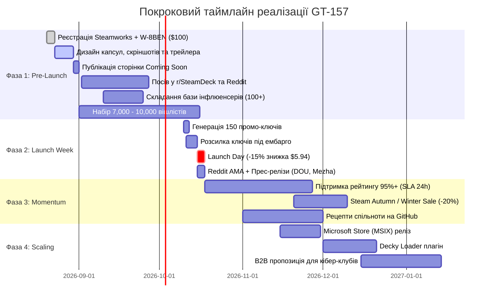

# GT-157: Покрокова практична інструкція з реалізації маркетингового плану запуску GameTrimmer

Цей документ є вичерпним практичним посібником (Playbook) для втілення кожного пункту маркетингової стратегії [GT-157 (id: 335)](http://127.0.0.1:3456) за епіком [GT-EP11 (id: 321)](http://127.0.0.1:3456). Усі завдання розбиті на покрокові технічні, дизайнерські, контентні та організаційні інструкції з готовими шаблонами, командами та критеріями перевірки.

---

## Зміст

1. [Фаза 1: Pre-Launch (T-60 ... T-0 днів) — Підготовка та набір 7k–10k вішлістів](#фаза-1-pre-launch-t-60--t-0-днів)
   - [1.1. Створення, оптимізація та верифікація сторінки в Steam](#11-створення-оптимізація-та-верифікація-сторінки-в-steam)
   - [1.2. Open-Core та воронка лідів через GitHub / CLI](#12-open-core-та-воронка-лідів-через-github--cli)
   - [1.3. Органічний посів у Reddit та профільних спільнотах](#13-органічний-посів-у-reddit-та-профільних-спільнотах)
   - [1.4. Гейміфікація вішлістів (Wishlist Milestones)](#14-гейміфікація-вішлістів-wishlist-milestones)
2. [Фаза 2: Launch Blast (T-0 ... T+14 днів) — Релізний вибух та конверсія](#фаза-2-launch-blast-t-0--t14-днів)
   - [2.1. Ціноутворення, релізний запуск та активація знижки](#21-ціноутворення-релізний-запуск-та-активація-знижки)
   - [2.2. Інфлюенсер-кампанія та розсилка ключів (YouTube / TikTok / Deck)](#22-інфлюенсер-кампанія-та-розсилка-ключів-youtube--tiktok--deck)
   - [2.3. Медіа-висвітлення та прес-релізи (Global + Ukraine)](#23-медіа-висвітлення-та-прес-релізи-global--ukraine)
   - [2.4. Внутрішньопрограмний віральний цикл (In-App Share Card)](#24-внутрішньопрограмний-віральний-цикл-in-app-share-card)
3. [Фаза 3: Post-Launch Momentum (T+15 ... T+90 днів) — Алгоритмічний ріст](#фаза-3-post-launch-momentum-t15--t90-днів)
   - [3.1. Управління відгуками та підтримка (SLA 24 години)](#31-управління-відгуками-та-підтримка-sla-24-години)
   - [3.2. Участь у сезонних розпродажах Steam](#32-участь-у-сезонних-розпродажах-steam)
   - [3.3. Користувацькі пресети та Community Hub](#33-користувацькі-пресети-та-community-hub)
4. [Фаза 4: Мультиплатформне масштабування та B2B (3–12 місяців)](#фаза-4-мультиплатформне-масштабування-та-b2b-312-місяців)
   - [4.1. Публікація в Microsoft Store (MSIX)](#41-публікація-в-microsoft-store-msix)
   - [4.2. Розробка офіційного плагіна Decky Loader для Steam Deck](#42-розробка-офіційного-плагіна-decky-loader-для-steam-deck)
   - [4.3. B2B пакети для кібер-клубів та комп'ютерних арен](#43-b2b-пакети-для-кібер-клубів-та-компютерних-арен)
5. [Зведений оперативний таймлайн та чек-лист](#зведений-оперативний-таймлайн-та-чек-лист)

---

## Фаза 1: Pre-Launch (T-60 ... T-0 днів)

Головна мета: відкрити публічну сторінку "Coming Soon" у Steam якомога раніше та залучити **7,000 – 10,000 вішлістів** до дня релізу.

---

### 1.1. Створення, оптимізація та верифікація сторінки в Steam

#### Крок 1.1.1. Організаційна реєстрація у Steamworks
1. **Створення кабінету розробника:** Зайти на [partner.steamgames.com](https://partner.steamgames.com) під обліковим записом Steam.
2. **Сплата Steam Direct Fee:** Сплатити $100 за слот застосунку (повертається після перших $1,000 валового доходу).
3. **Податкове інтерв'ю (W-8BEN):**
   - Заповнити онлайн-форму для нерезидентів США (для фізичної особи або ФОП з України).
   - Вказати український податковий номер (ІПН / РНОКПП). Завдяки двосторонній угоді про уникнення подвійного оподаткування ставка утримання податку США на авторську винагороду знижується до **10%** (замість 30%).
4. **Банківські реквізити:** Вказати валютний IBAN (USD/EUR) рахунок ФОП (Приват24 для бізнесу, monobank, тощо) та SWIFT-код банку.

#### Крок 1.1.2. Підготовка та завантаження графічних асетів (Capsules)
Steam має суворі вимоги до графіки. Усі файли зберігати у форматі PNG (RGB 24-bit / 32-bit без надлишкового стиснення):

| Назва асету | Розмір (px) | Де показується | Вимоги до композиції |
|---|---|---|---|
| **Header Capsule** | `460 x 215` | Головні списки пошуку, результати категорій | Чіткий логотип, висококонтрастний фон (темний з неоново-зеленим/синім акцентом вивільнення простору). Без тексту знижок! |
| **Small Capsule** | `231 x 87` | Бокові блоки, списки рекомендацій | Максимально читабельний логотип GameTrimmer на темному тлі, мінімум дрібних деталей. |
| **Main Capsule** | `616 x 353` | Головний банер на сторінці категорії та спецпропозицій | Логотип, візуалізація SSD-накопичувача/диска, піктограми Steam Deck + PC. |
| **Vertical Capsule** | `374 x 448` | Новий інтерфейс бібліотеки Steam та мобільний клієнт | Вертикальна композиція з домінуючим логотипом по центру або вгорі. |
| **Page Background** | `1438 x 810` | Тло сторінки магазину | Темний градієнт з ледь помітною текстурою схем/заліза (не відволікає від тексту). |
| **Community Icon** | `32 x 32` | Іконка у спільнотах та списках друзів | Контрастний символ (наприклад, стилізована блискавка/ножиці + диск). |
| **Client Icon** | `184 x 184` | Іконка у списку встановлених програм клієнта | Чітка висока роздільна здатність, прозорий або темний фон. |

> [!WARNING]
> Згідно з правилами Steam (оновлення Valve 2022+), на капсульних зображеннях **суворо заборонено** розміщувати: оцінки оглядів (наприклад, "95% Positive"), згадки знижок ("-15% Off"), ціни або текстові заяви про якість ("Best Cleaner"). Порушення блокує схвалення сторінки.

#### Крок 1.1.3. Створення набору скріншотів з інфографікою (1920x1080)
Підготувати 6 брендованих скріншотів:
1. **Скріншот 1 (Dashboard Overview):** Головний екран GameTrimmer з кнопкою *"One-Click Safe Trim"* та загальним статусом *"92.4 GB can be reclaimed"*.
2. **Скріншот 2 (Granular Breakdown):** Таблиця сканування: категорії *Unused Language Voiceovers*, *Duplicate Video Files*, *Orphaned Shader Caches*, *Redistributables*.
3. **Скріншот 3 (AAA Game Benchmark):** Наочна порівняльна плашка "До/Після" на прикладі топ-ігор:
   - *Baldur's Gate 3:* `-24.2 GB`
   - *Cyberpunk 2077:* `-18.5 GB`
   - *S.T.A.L.K.E.R. 2:* `-31.0 GB`
4. **Скріншот 4 (Anti-Cheat & VAC Shield):** Екран безпеки з активними зеленими індикаторами *"VAC Protected"*, *"EasyAntiCheat Safe"*, *"BattlEye Safe"*.
5. **Скріншот 5 (Steam Deck Handheld Mode):** Інтерфейс у роздільній здатності 1280x800 з великими елементами керування під геймпад/тачскрін.
6. **Скріншот 6 (Fast Rust Engine):** Вікно статусу сканування: *"Scanned 48 installed games (2.4 TB) in 3.8 seconds"*.

#### Крок 1.1.4. Виробництво промо-трейлера (45–60 секунд)
**Покадровий сценарій (Storyboard):**
- `00:00 - 00:06` **Хук проблеми:** Червоний індикатор диска Windows/Steam Deck "Storage Full (98%)" → спроба встановити оновлення гри → помилка *"Not enough disk space"*.
- `00:06 - 00:18` **Швидкість GameTrimmer:** Запуск програми (миттєве вікно за 20 мс) → клік *"Scan All Libraries"* → прогрес-бар пролітає за 3 секунди → виявлено 84.6 GB зайвого баласту.
- `00:18 - 00:32` **Що саме очищається:** Анімація розгортання папок:
  - Видалення невикористовуваної озвучки (французька, німецька, китайська мови в RPG).
  - Дедуплікація повторюваних важких відео через NTFS Hardlinks (показ збереження цілісності файлів).
  - Очищення застарілих кешів шейдерів DirectX/Vulkan.
- `00:32 - 00:44` **Безпека та Сумісність:** Плашка *"100% Anti-Cheat & VAC Safe Guarantee"* + демонстрація роботи на ПК та на Steam Deck (SteamOS).
- `00:44 - 00:60` **Заклик до дії (CTA):** Фінальний екран *"Reclaim your SSD space today. Add to Wishlist on Steam!"* + логотип GameTrimmer.

**Технічні параметри відео для Steam:**
- Формат: MP4 (H.264 / AAC) + WebM (VP9).
- Роздільна здатність: `1920x1080` (або `2560x1440`), 60 FPS.
- Бітрейт відео: 15–20 Mbps. Бітрейт аудіо: 320 kbps Stereo.
- Мова субтитрів: англійська (вбудовані в трейлер + окремий файл `.vtt` для Steam).

#### Крок 1.1.5. Копірайтинг та структура опису сторінки магазину
Опис оформлюється через вбудований BBCode у Steamworks:

```bbcode
[h1]Reclaim 50–100+ GB of SSD Storage Without Uninstalling Your Games[/h1]
Modern AAA games like [i]Baldur's Gate 3[/i], [i]Call of Duty[/i], and [i]Cyberpunk 2077[/i] consume 100GB to 175GB each. Your fast NVMe SSD or handheld PC (Steam Deck, ROG Ally) quickly runs out of space.

[b]GameTrimmer[/b] is an ultra-fast, native Rust utility that safely trims gigabytes of game-specific ballast, unused language audio packs, redundant redistributables, and duplicate cutscenes without touching game saves or risking anti-cheat penalties.

[h2]⚡ Key Features[/h2]
[list]
[*] [b]Blazing Fast Rust Engine:[/b] Scans a 2TB library with 50+ games in under 4 seconds. No Electron bloat, zero background resource consumption.
[*] [b]Safe Language Trimming:[/b] Remove 20–30 GB of foreign audio tracks (German, French, Japanese voiceovers) you will never listen to.
[*] [b]NTFS Hardlink Deduplication:[/b] Merges duplicate monolithic assets without breaking file integrity or launcher verification.
[*] [b]Redist & Cache Cleanup:[/b] Eradicates leftover DirectX, VCRedist installers, crash dumps, and obsolete shader caches.
[*] [b]Steam Deck & Handheld Optimized:[/b] Native Linux / SteamOS support with gamepad-friendly navigation.
[/list]

[h2]🛡️ 100% Anti-Cheat & VAC Safe Guarantee[/h2]
GameTrimmer operates strictly on passive data. It never attaches to game processes, never injects code into system memory, and never alters protected multiplayer binaries (.exe / .dll). Safe for [i]CS2, Dota 2, Apex Legends, Destiny 2[/i], and more.

[h2]💎 Fair "Pay-Once, Own Forever" Model[/h2]
No subscriptions. No account registration. Zero telemetry. Works completely offline forever.
```

#### Крок 1.1.6. Подання на модерацію та відкриття сторінки (Coming Soon)
1. У панелі Steamworks натиснути **"Mark Store Presence as Ready for Review"**.
2. Очікувати схвалення модераторів Valve (займає 2–4 робочих дні).
3. Після зеленого статусу натиснути **"Publish Store Page (Coming Soon)"**.
4. З цього моменту сторінка доступна публічно, індексується пошуком Steam та починає збирати вішлісти.

---

### 1.2. Open-Core та воронка лідів через GitHub / CLI

Головна мета: перетворити популярність безкоштовного CLI-інструменту на сторінці GitHub у потік конверсій на платну Steam-версію.

#### Крок 1.2.1. Архітектурне розділення та структурування репозиторію
1. Ядро сканування та дедуплікації оформлюється як публічний Rust-крейт `gametrimmer-core` на GitHub під ліцензією MIT:
   ```bash
   gametrimmer/
   ├── crates/
   │   ├── gametrimmer-core/      # Публічне відкрите ядро (MIT)
   │   └── gametrimmer-cli/       # Відкрита CLI-утиліта (MIT)
   ├── Cargo.toml
   ├── README.md
   └── LICENSE
   ```
2. Повноцінний GUI (з графічним інтерфейсом egui, автооновленням пресетів, візуалізатором дисків та інтеграцією Steam Deck) є релізним продуктом у Steam.

#### Крок 1.2.2. Впровадження інтерактивного CTA у вивід терміналу CLI
У коді `gametrimmer-cli` додати акуратне повідомлення після завершення сканування/очищення:

```rust
pub fn print_completion_banner(freed_bytes: u64) {
    let freed_gb = freed_bytes as f64 / 1024.0 / 1024.0 / 1024.0;
    println!("\n{}", "─".repeat(60));
    println!("✨ Reclaimed {:.2} GB of disk space successfully!", freed_gb);
    println!("{}", "─".repeat(60));
    println!("💡 Prefer an automated 1-Click GUI with Steam Deck support & game presets?");
    println!("👉 Wishlist GameTrimmer on Steam: https://store.steampowered.com/app/XXXXXX");
    println!("{}\n", "─".repeat(60));
}
```

#### Крок 1.2.3. Банер у GitHub README.md
У кореневому `README.md` розмістити промо-блок у верхній третині сторінки:

```markdown
<div align="center">
  <a href="https://store.steampowered.com/app/XXXXXX">
    
  </a>
  <p>
    <a href="https://store.steampowered.com/app/XXXXXX"><strong>👉 Wishlist GameTrimmer on Steam for 1-Click GUI, Handheld Mode & Auto-Presets 👈</strong></a>
  </p>
</div>
```

---

### 1.3. Органічний посів у Reddit та профільних спільнотах

#### Крок 1.3.1. Стратегія постів у Reddit (Value-First підхід)
Спільноти Reddit блокують пряму саморекламу. Успіх гарантує підхід **"Аналітичне дослідження / Допомога гравцям"**:

1. **Цільові сабреддіти:**
   - `r/SteamDeck` (найбільш гаряча та вдячна аудиторія)
   - `r/pcgaming`
   - `r/lowendgaming`
   - `r/pcmasterrace`
   - `r/rust` (технічний розбір реалізації парсера MFT та NTFS hardlinks)
   - `r/linux_gaming`

2. **Графік публікацій:**
   - **T-45 днів:** Аналітичний пост із таблицею дослідження розмірів ігор (приклад: *"We analyzed top 50 Steam games..."*).
   - **T-20 днів:** Оголошення бета-тесту / показ інтерфейсу для Steam Deck (відео з демонстрацією на реальному девайсі).
   - **T-0 (День релізу):** Релізний анонс + роздача 20 безкоштовних ключів у коментарях для перших тестувальників.

#### Крок 1.3.2. Підготовка Press Kit (Прес-кіта)
Створити публічну сторінку (наприклад, `gametrimmer.app/press` або публічну папку Google Drive / GitHub Pages) з наступними матеріалами:
1. **Factsheet (Факти про проєкт):**
   - Назва: GameTrimmer
   - Розробник: [Ім'я / Студія], незалежний інді-розробник з України
   - Дата релізу: [Дата]
   - Платформи: Windows 10/11, SteamOS (Steam Deck), Linux
   - Модель та ціна: Одноразова покупка $6.99 (регіональні ціни у Steam)
   - Стек: 100% Rust (`egui`, `rusqlite`, `windows-rs`, `ntfs`)
2. **Асети високої роздільної здатності:**
   - Логотипи на прозорому фоні (PNG / SVG).
   - Скріншоти інтерфейсу 4K без водяних знаків.
   - Банери "До/Після" на популярних іграх.
   - Портрет розробника або студійний логотип.
3. **Прес-реліз у форматі PDF / Markdown.**

---

### 1.4. Гейміфікація вішлістів (Wishlist Milestones)

Оголосити у спільноті (Steam Community Hub, Twitter/X, Reddit) систему цілей:
- **3,000 Вішлістів:** Гарантована стартова знижка -15% на перші 14 днів.
- **7,000 Вішлістів:** Включення до релізного білду пресетів для 30 додаткових ретро- та JRPG-ігор.
- **12,000 Вішлістів:** Розробка безкоштовного інтегрованого плагіна для Decky Loader (SteamOS).

Публікувати щотижневі оновлення зі статусом прогрес-бару в новинах Steamworks, стимулюючи додавання у вішлісти.

---

## Фаза 2: Launch Blast (T-0 ... T+14 днів)

Головна мета: максимізувати імпульс перших 72 годин, підняти конверсію вішлістів до 20%, потрапити в розділ "New & Trending" та "Top Sellers / Software" у Steam.

---

### 2.1. Ціноутворення, релізний запуск та активація знижки

#### Крок 2.1.1. Налаштування регіональних цін у Steamworks
1. Зайти в **Steamworks → Pricing & Packages**.
2. Встановити базову ціну **$6.99 USD**.
3. Застосувати офіційну регіональну матрицю Valve (Recommended Valve Matrix):
   - Україна: `~199 ₴`
   - Європейський Союз: `€6.89`
   - Велика Британія: `£5.89`
   - Польща: `29.99 PLN`
   - Регіони LATAM / MENA / SASIA: за зниженою регіональною шкалою ($3.49 – $4.99).

#### Крок 2.1.2. Налаштування Launch Discount
1. У розділі **Special Settings & Discounts** обрати **"Launch Discount"**.
2. Встановити **15%** (ціна на релізі стане **$5.94 / 169 ₴**).
3. Тривалість: максимальна дозволена Valve — **14 календарних днів**.

#### Крок 2.1.3. Натискання кнопки "Release Now"
1. Перевірити, що production білд завантажено у гілку `default` через SteamPipe.
2. Натиснути **"Release App"**.
3. *Ефект:* Алгоритми Steam автоматично відправляють персоналізовані email-сповіщення усім користувачам, які мали GameTrimmer у вішлісті.

---

### 2.2. Інфлюенсер-кампанія та розсилка ключів (YouTube / TikTok / Deck)

#### Крок 2.2.1. Генерація пулу ключів у Steamworks
1. Перейти в **Steamworks → Request Steam Product Keys**.
2. Обрати тип: **"Release State Override / Review Keys"** (працюють навіть до публічного релізу, не мають обмежень).
3. Замовити партію: **150 ключів**.
4. Valve схвалює генерацію протягом 12–24 годин.

#### Крок 2.2.2. База контактів та сегментація
Скласти Google Таблицю з 80–100 авторами за трьома основними сегментами:
- **Сегмент 1 (Steam Deck & Handhelds):** *Deckverse*, *SteamDeckHQ*, *GamingOnLinux*, *Overkill.wtf*, *Fan The Deck*, *CryoByte33*, *Retro Game Corps*.
- **Сегмент 2 (PC Optimization & Tech):** *LowSpecGamer*, *RandomGaminginHD*, *Dawid Does Tech Stuff*, *Ancient Gameplays*, *Linus Tech Tips (Forum/Floatplane)*.
- **Сегмент 3 (Українські техно- та ігрові канали):** *OldBoi*, *GameDev DOU*, *Падон*, *Таємна Кімната*, *Mezha.Media*.

#### Крок 2.2.3. Покроковий процес розсилки (Outreach Email)
Розсилати персоналізовані листи за 5 днів до релізу зі зняттям ембарго в день виходу (T-0):

```text
Subject: Review Copy: GameTrimmer – Native Rust tool that reclaims 50-100GB on Steam Deck & PC

Hi [Name],

I love your content on [Topic: Steam Deck tweaks / PC storage optimizations]!

I’m the developer of GameTrimmer, a lightweight, native Rust tool built specifically to solve the massive game size issue on Steam Deck & PC (where Baldur's Gate 3, STALKER 2, and Warzone take 150GB+ each).

Unlike generic disk cleaners, GameTrimmer:
• Safely trims unused foreign voiceover packs (saves 20-30GB per RPG)
• Merges duplicate videos/assets using zero-copy NTFS hardlinks
• Cleans orphaned shader caches and redistributables
• 100% Anti-Cheat / VAC safe (zero memory modification, passive files only)
• Launches instantly in 20ms and scans entire libraries in 3 seconds

Here is a Steam key to test on your setup:
Steam Key: [XXXXX-XXXXX-XXXXX]
Press Kit & High-Res Benchmarks: https://gametrimmer.app/press

If you have any questions or feature requests, feel free to reply directly to this email!

Best regards,
[Your Name]
GameTrimmer Developer
```

#### Крок 2.2.4. Використання Steam Curator Connect
1. У Steamworks відкрити **Curator Connect**.
2. Знайти та надіслати 100 прямих цифрових копій кураторам за тегами: `Utilities`, `Steam Deck`, `Software`, `Optimization`.

---

### 2.3. Медіа-висвітлення та прес-релізи (Global + Ukraine)

1. **День релізу (T-0, 16:00 за Києвом / 06:00 PST):**
   - Розіслати прес-реліз до редакцій: *PC Gamer*, *Wccftech*, *Tom's Hardware*, *TechPowerUp*, *GamingOnLinux*, *Mezha.Media*, *ITC.ua*, *DOU.ua*.
2. **Публікація на DOU.ua:** Опублікувати статтю в розділі GameDev/Блоги: *"Як я створив нативну Rust-утиліту для оптимізації ігор у Steam: архітектура, безпека та запуск на Steam Deck"*.
3. **Reddit Launch AMA:** Запустити гілку в `r/SteamDeck` та `r/pcgaming`:
   - *"Hi Reddit! I built GameTrimmer, an open-core native Rust utility that safely freed 80GB on my Steam Deck without deleting games. Ask Me Anything!"*

---

### 2.4. Внутрішньопрограмний віральний цикл (In-App Share Card)

Головна мета: щоб кожен задоволений користувач міг в один клік похвалитися зекономленим місцем у Discord, X (Twitter) та Reddit.

#### Крок 2.4.1. Архітектура генерації підсумкової картки в Rust
Після успішного завершення процедури оптимізації відкривається модальне вікно або банер із підсумком:

```rust
pub struct TrimSummary {
    pub total_freed_bytes: u64,
    pub games_optimized_count: usize,
    pub top_games: Vec<String>,
    pub elapsed_seconds: f64,
}
```

#### Крок 2.4.2. Рендеринг зображення для буфера обміну (Copy Image to Clipboard)
Використовувати крейт `image` для генерації акуратного PNG-зображення 800x450 px з логотипом, прогрес-баром та результатом і копіювання його у буфер обміну Windows/Linux:

```rust
pub fn generate_share_text(summary: &TrimSummary) -> String {
    let freed_gb = summary.total_freed_bytes as f64 / 1024.0 / 1024.0 / 1024.0;
    format!(
        "🎮 Just reclaimed {:.1} GB of SSD space with @GameTrimmerApp in {:.1}s!\n\
        Optimized {} games without reinstalling. 🚀\n\
        Get it on Steam: https://store.steampowered.com/app/XXXXXX",
        freed_gb, summary.elapsed_seconds, summary.games_optimized_count
    )
}
```

#### Крок 2.4.3. Реалізація кнопок швидкого шерингу в UI
Додати клікабельні кнопки:
- **[ Copy Image & Text ]** → Записує PNG-картку та текст у системний буфер обміну.
- **[ Share on X / Twitter ]** → Відкриває браузер із готовим URL:
  `https://twitter.com/intent/tweet?text=<URL_ENCODED_TEXT>&hashtags=SteamDeck,Gaming,PCGaming,Rust`
- **[ Share on Reddit ]** → Відкриває вікно подання посту в сабреддіт `r/SteamDeck` або `r/pcgaming`.

---

## Фаза 3: Post-Launch Momentum (T+15 ... T+90 днів)

Головна мета: захистити рейтинг 95%+ ("Overwhelmingly Positive"), скористатися перевагами сезонних розпродажів Steam та перетворити користувачів на постійне джерело нових пресетів.

---

### 3.1. Управління відгуками та підтримка (SLA 24 години)

1. **Моніторинг оглядів у Steamworks:**
   - Налаштувати щоденну перевірку розділу **User Reviews**.
2. **Шаблон відповіді на негативний або проблемний відгук:**
   ```text
   Hi [User Name], developer of GameTrimmer here!

   Thank you for reporting this issue with [Game Name]. I'm really sorry you encountered this.
   I've already investigated the issue and pushed an update (v1.0.X) that resolves this pattern.

   If you're still experiencing any trouble, please feel free to reach out directly via our Steam Community Hub or GitHub Issues. I'd love to help you get this resolved!
   ```
3. **Швидкі патчі (Hotfix Pipeline):** Усі критичні баги нових релізів ігор виправляти та публікувати оновлення протягом 24–48 годин через автоматизований CI/CD SteamPipe.

---

### 3.2. Участь у сезонних розпродажах Steam

1. **Реєстрація у великих розпродажах:**
   - Steam Summer Sale / Autumn Sale / Winter Sale / Spring Sale.
   - Встановлювати знижку **20% – 25%** ($5.24 – $5.59).
2. **Steam Bundles (Спільні набори):**
   - Зв'язатися з розробниками суміжних популярних утиліт у Steam (*Lossless Scaling*, *Borderless Gaming*, *DisplayFusion*).
   - Створити бандл *"Ultimate PC Gamer Optimization Bundle"* зі знижкою 10% на весь комплект (приносить крос-трафік з бази користувачів іншої програми).

---

### 3.3. Користувацькі пресети та Community Hub

#### Крок 3.3.1. Стандартизований формат рецептів (Game Recipe Schema)
Створити прозорий формат опису правил оптимізації ігор у JSON або TOML:

```json
{
  "game_id": "app_1086940",
  "game_name": "Baldur's Gate 3",
  "safe_language_paths": [
    "Data/Localization/German.pak",
    "Data/Localization/French.pak",
    "Data/Localization/Spanish.pak"
  ],
  "duplicate_video_patterns": [
    "Data/Video/**/*.bk2"
  ],
  "safe_cleanup_redist": true,
  "anticheat_protected": false
}
```

#### Крок 3.3.2. Community Pull Request Engine
- Відкрити репозиторій `gametrimmer-recipes` на GitHub.
- Користувачі можуть додавати правила для нових ігор через звичайні PR.
- Автоматичний бекенд-валідатор перевіряє рецепти на безпеку та публікує їх у щотижневі оновлення бази GameTrimmer.

---

## Фаза 4: Мультиплатформне масштабування та B2B (3–12 місяців)

---

### 4.1. Публікація в Microsoft Store (MSIX)

Головна мета: охопити підписників **PC Game Pass**, які страждають від величезних закритих ігрових папок у Windows 11.

#### Крок 4.1.1. Реєстрація у Microsoft Partner Center
1. Зареєструвати обліковий запис розробника на [partner.microsoft.com](https://partner.microsoft.com) ($19 USD одноразовий внесок для фізособи/компанії).
2. Пройти верифікацію особистості.

#### Крок 4.1.2. Створення маніфесту та збірка MSIX пакета
1. Створити файл маніфесту `AppxManifest.xml`:
   ```xml
   <?xml version="1.0" encoding="utf-8"?>
   <Package xmlns="http://schemas.microsoft.com/appx/manifest/foundation/windows10"
            xmlns:uap="http://schemas.microsoft.com/appx/manifest/uap/windows10"
            xmlns:rescap="http://schemas.microsoft.com/appx/manifest/foundation/windows10/restrictedcapabilities">
     <Identity Name="GameTrimmer.App"
               Publisher="CN=YourPublisherID"
               Version="1.0.0.0"
               ProcessorArchitecture="x64" />
     <Properties>
       <DisplayName>GameTrimmer: Game Storage Optimizer</DisplayName>
       <PublisherDisplayName>GameTrimmer</PublisherDisplayName>
       <Logo>Assets\StoreLogo.png</Logo>
     </Properties>
     <Dependencies>
       <TargetDeviceFamily Name="Windows.Desktop" MinVersion="10.0.19041.0" MaxVersionTested="10.0.26100.0" />
     </Dependencies>
     <Capabilities>
       <rescap:Capability Name="runFullTrust" />
     </Capabilities>
     <Applications>
       <Application Id="GameTrimmer" Executable="gametrimmer.exe" EntryPoint="Windows.FullTrustApplication">
         <uap:VisualElements DisplayName="GameTrimmer"
                             Description="Ultra-fast game storage optimizer for PC and Steam Deck"
                             BackgroundColor="transparent"
                             Square150x150Logo="Assets\Square150x150Logo.png"
                             Square44x44Logo="Assets\Square44x44Logo.png" />
       </Application>
     </Applications>
   </Package>
   ```
2. Зібрати пакет за допомогою Windows SDK utility:
   ```cmd
   MakeAppx.exe pack /d .\package_root /p GameTrimmer_1.0.0.0_x64.msix
   ```
3. Завантажити `.msix` у Microsoft Partner Center. Модерація триває 24–48 годин.

---

### 4.2. Розробка офіційного плагіна Decky Loader для Steam Deck

Головна мета: забезпечити безшовний доступ до оптимізації прямо з інтерфейсу Steam Deck Gaming Mode (Quick Access Menu `...`).

#### Крок 4.2.1. Архітектура плагіна
- **Фронтенд (UI):** React / TypeScript віджет для бічного меню Decky.
- **Бекенд (Daemon Bridge):** Легкий Python / Unix Socket міст, що викликає встановлений нативний бінарник `gametrimmer`.

#### Крок 4.2.2. Подача плагіна до офіційного каталогу Decky Store
1. Форкнути офіційний репозиторій `Decky-Loader/decky-plugin-database`.
2. Додати плагін `decky-gametrimmer` у каталог.
3. Плагін є безкоштовним компаньйоном, що керує ліцензованою версією утиліти.

---

### 4.3. B2B пакети для кібер-клубів та комп'ютерних арен

Головна мета: монетизація комп'ютерних клубів (20–100 ПК), де постійно не вистачає місця на серверних та клієнтських накопичувачах через десятки встановлених ігор.

#### Крок 4.3.1. Реалізація автономного тихий-режиму CLI (Silent Headless Mode)
Додати прапорці запуску для планувальника завдань Windows (Task Scheduler):
```cmd
gametrimmer.exe --silent --auto-all --report-dir "C:\ClubLogs\GameTrimmer" --json
```

#### Крок 4.3.2. Комерційна пропозиція (B2B Site License)
- **Ціна:** $99 – $199 на рік за клуб (до 50 ПК).
- **Постачання:** Безлімітний автономний бінарник, офлайн-активація за ключем, пріоритетна підтримка у Telegram/Discord.
- **Аутріч:** Прямий контакт адміністраторів та мереж кібер-клубів (Україна, Польща, Казахстан, країни ЄС).

---

## Зведений оперативний таймлайн та чек-лист



### Фінальний чек-лист готовності до запуску:
- [ ] Оплачено Steam Direct Fee ($100) та підтверджено W-8BEN (10% податок).
- [ ] Завантажено повний пакет капсул (Header, Small, Main, Vertical) без порушення правил Valve.
- [ ] Змонтовано динамічний трейлер (45–60 сек) зі звуком та субтитрами.
- [ ] Сторінку "Coming Soon" схвалено та опубліковано.
- [ ] Впроваджено банер із закликом до вішліста у `gametrimmer-core` (GitHub + CLI).
- [ ] Зібрано базу зі 100+ авторів YouTube/TikTok та підготовлено Press Kit.
- [ ] Запрограмовано функціонал In-App Share Card для вірального шерингу в X/Reddit.
- [ ] Налаштовано стартову знижку -15% ($5.94) у Steamworks.
- [ ] Опубліковано реліз та розіслано прес-релізи.
- [ ] Запущено підготовку MSIX для Microsoft Store та плагіна для Decky Loader.
