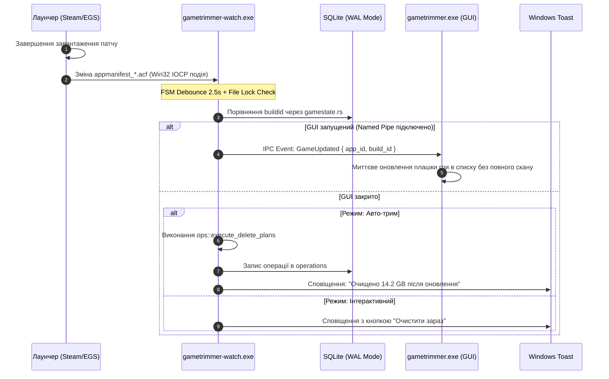

# Епік GT-EP12: Фоновий моніторинг оновлень ігор та автоматичний повторний трим (Background Game Update Monitoring & Auto-Retrim Engine)

- **Дата створення та актуалізації:** 18 серпня 2026 року
- **Батьківський проект:** GameTrimmer (v1.0.0+)
- **Статус епіку:** Затверджено до розробки / До виконання
- **Інтегровані спайки:**
  - *Спайк GT-138:* Дослідження інокуляції ігор від оновлень та поведінки лаунчерів (Steam, EGS, GOG, EA, Ubisoft, Xbox).
  - *Спайк GT-158:* Низькорівневі Win32 API моніторингу (IOCP vs Overlapped vs USN Journal, Zero-CPU, Working Set).
  - *Спайк GT-159:* Порівняльний аналіз мов програмування та рантаймів (Rust vs C/C++ vs Go vs C# vs Python/Node).
  - *Спайк GT-160-S:* Анатомія маніфестів, бітмаска `StateFlags`, FSM-дебаунсинг та перевірка блокування файлів (`ERROR_SHARING_VIOLATION`).
  - *Спайк GT-161-S:* Локальний IPC (Named Pipes), синхронізація з SQLite WAL та автономний авто-трим.
- **Цільові метрики фонового демона (`gametrimmer-watch.exe`):**
  - **Споживання пам'яті (Working Set / RSS):** $\le \mathbf{2.0\text{ MB}}$ (Private Bytes $< 1.0\text{ MB}$).
  - **Навантаження на CPU у стані очікування:** строго $\mathbf{0.00\%}$ (глибокий Kernel Wait `KWAIT_BLOCK` через IOCP).
  - **DPC Latency / Jitter для ігор:** $\mathbf{0\text{ ms}}$ (нуль GC-пауз, відсутність сторонніх VM-потоків).
  - **Розмір бінарного файлу:** $\le \mathbf{1.8\text{ MB}}$.

---

## 1. Головне резюме (Executive Summary)

1. **Проблема:** Під час випуску оновлень або штатної перевірки цілісності («Verify files») лаунчери (Steam, EGS, GOG тощо) повторно завантажують гігабайти видаленого раніше баласту (мовні озвучки на 15–30 ГБ, вступні ролики, шейдери).
2. **Чому агресивне блокування (інокуляція) заборонене:** Спроби заблокувати файли маніфестів через `attrib +r`, Deny ACLs чи підміну `buildid` викликають критичні помилки лаунчерів (**«Disk write error»**, **«Missing file privileges»**, зависання черги або повний перекач гри).
3. **Рішення GT-EP12:** **«Кооперативний фоновий життєвий цикл + Цільовий авто-трим»**. Лаунчер штатно застосовує патч, а ультралегкий демон `gametrimmer-watch.exe` фіксує зміну `buildid` через плоский моніторинг директорії маніфестів на Win32 IOCP і виконує моментальний повторний трим лише оновленої гри без помилок.
4. **Вибір мови:** **Rust** є безальтернативним лідером. Він забезпечує нульовий оверхед, пам'ять $\le 2\text{ MB}$ RSS, відсутність фризів від Garbage Collector та 100% повторне використання бізнес-логіки з `gametrimmer-core`.

---

## 2. Інтегровані дослідження та спайки

```
┌──────────────────────────────────────────────────────────────────────────────────────────────────┐
│                               ІНТЕГРОВАНІ СПАЙКИ ЕПІКУ GT-EP12                                   │
├─────────────┬─────────────────────────────────────────────────────────────────┬──────────────────┤
│ Спайк       │ Тематика дослідження                                            │ Результат        │
├─────────────┼─────────────────────────────────────────────────────────────────┼──────────────────┤
│ Спайк GT-138│ Поведінка лаунчерів та оцінка методів інокуляції                │ Заборона +r ACL  │
│ Спайк GT-158│ Win32 Filesystem API: IOCP, ReadDirectoryChangesW, Zero-CPU, WS │ Плоский IOCP FSM │
│ Спайк GT-159│ Порівняння мов: Rust vs C++ vs Go vs C# vs Python/Electron      │ Rust (Native GT) │
│ Спайк GT-160│ Анатомія маніфестів, бітмаска StateFlags, File Lock Check       │ Debounce FSM 2.5s│
│ Спайк GT-161│ Архітектура IPC (Named Pipes), SQLite WAL, Toast & Auto-Trim    │ Local Pipe Async │
└─────────────┴─────────────────────────────────────────────────────────────────┴──────────────────┘
```

---

### 2.1. Спайк GT-138: Дослідження можливостей інокуляції та поведінки лаунчерів

Досліджено поведінку цифрових платформ при спробах зовнішнього блокування оновлень або модифікації ігрових директорій.

#### Порівняльний аналіз реакції лаунчерів:

| Лаунчер | Джерело метаданих | Реакція на `attrib +r` маніфесту | Реакція на підміну `buildid` | Прямий запуск `.exe` (Bypass) |
| :--- | :--- | :--- | :--- | :--- |
| **Steam** | `steamapps/appmanifest_*.acf` | **Критична помилка:** «Disk write error», зависання черги | **Фатально:** Помилка хешування дельта-патчу → Full Redownload | Працює для DRM-Free (Cyberpunk, BG3); Steamworks перехоплює фокус |
| **Epic Games** | `%ProgramData%\Epic\...\*.item` | Помилка запису маніфесту; бейдж «Update Failed» | Помилка перевірки маніфесту в хмарі | Працює з прапорцем `-EpicPortal` для більшості синглплеєрів |
| **GOG Galaxy** | `%ProgramData%\GOG.com\Galaxy\storage\` | Скидання налаштувань бази SQLite `galaxy-2.0.db` | Відкат версії підтримується штатно | **100% DRM-Free** (прямий запуск без клієнта) |
| **EA App** | `%ProgramData%\EA Desktop\` | Помилка сервісу `EABackgroundService.exe` | Блокування кнопки «Play» | Працює в автономному режимі (Offline token) |
| **Ubisoft** | Реєстр Windows + `uplay_install.state` | Блокування запуску, вимога оновлення | Помилка верифікації білда | Вимагає авторизації через `upc.exe` |
| **Xbox / MS Store** | `WindowsApps` / MSIX контейнери | **Недоступно:** Захист `TrustedInstaller` | Миттєвий авто-ремонт пакета | **Out of Scope** (модифікація заблокована ОС) |

#### Оцінка стратегій інокуляції:
1. **0-byte Stub Files (Файли-заглушки нульового розміру):**
   - *Відео (Bink `.bik`, `.bk2`, `.mp4`):* Безпечно. `BinkOpen()` повертає `NULL`, рушій пропускає ролик і завантажує головне меню.
   - *Аудіо (Wwise `.pck`, FMOD `.bank`) та архіви UE (`.pak`):* **Небезпечно.** Парсери рушіїв падають з фатальною помилкою заголовка (`AK_InvalidFile`, `FPakFile corrupt`), що викликає `Access Violation (0xC0000005)`.
2. **NTFS Sparse Zeroing (`FSCTL_SET_SPARSE` + `FSCTL_SET_ZERO_DATA`):**
   - Дозволяє занулити мовні блоки всередині 50 ГБ `.pak` без зміни розміру файлу.
   - *Проблема:* Рушій при декомпресії отримує `DECOMPRESSION_CORRUPT_DATA`, а лаунчер при розрахунку дельти перекачує весь 50 ГБ файл заново.
3. **Блокування доступу (Deny ACL / Read-Only):**
   - Ламає нормальну роботу черги лаунчера, створюючи негативний користувацький досвід.
4. **Висновок спайку:** Відмовитися від примусового ламання оновлень на користь **Targeted Re-trim (GT-EP12)** — дозволити лаунчеру оновитися і моментально очистити оновлені файли за збереженим рецептом.

---

### 2.2. Спайк GT-158: Низькорівневі Win32 API для фонового моніторингу файлових подій

#### Порівняння механізмів ядра Windows:

```
                            АРХІТЕКТУРА ЯДРА ДЛЯ МОНІТОРИНГУ
 ┌────────────────────────────────────────┐     ┌────────────────────────────────────────┐
 │   АНТИПАТЕРН: Рекурсивний моніторинг   │     │    ПРАВИЛЬНО: Плоский моніторинг IOCP  │
 │   ReadDirectoryChangesW(Subtree=TRUE)  │     │   ReadDirectoryChangesW(Subtree=FALSE) │
 ├────────────────────────────────────────┤     ├────────────────────────────────────────┤
 │ • 500,000+ IRP-подій при патчі гри     │     │ • 2–5 подій на весь процес патчу       │
 │ • Переповнення черги ERROR_NOTIFY_ENUM │     │ • Нульовий ризик переповнення буфера   │
 │ • Блокування Atomic Directory Swap     │     │ • 0.00% CPU через GetQueuedCompletion  │
 │ • Споживання RAM 40–80 MB              │     │ • Споживання RAM < 1.5 MB              │
 └────────────────────────────────────────┘     └────────────────────────────────────────┘
```

1. **Чому `ReadDirectoryChangesW` + IOCP є ідеальним вибором:**
   - Дескриптори директорій відкриваються з прапорцями `FILE_LIST_DIRECTORY`, `FILE_SHARE_READ | FILE_SHARE_WRITE | FILE_SHARE_DELETE`, `FILE_FLAG_BACKUP_SEMANTICS | FILE_FLAG_OVERLAPPED`.
   - Прив'язка до одного порту `CreateIoCompletionPort`.
   - Потік засинає у виклику `GetQueuedCompletionStatus(hIOCP, ..., INFINITE)`. ОС видаляє потік із черги планувальника (`Ready Queue`). Витрата тактів CPU строго **0.00%**.
2. **Чому NTFS USN Journal (`FSCTL_READ_USN_JOURNAL`) відхилено:**
   - Вимагає обов'язкових прав **Адміністратора (UAC Elevation)** для дескриптора `\\.\C:`.
   - Працює виключно на NTFS (не підтримує exFAT на зовнішніх SSD).
   - Не підтримує вибіркові фільтри каталогів (будить потік на кожен запис браузера чи логу ОС).
3. **Оптимізація пам'яті (Working Set Reduction):**
   - Виклик `K32EmptyWorkingSet(GetCurrentProcess())` або `SetProcessWorkingSetSize(hProc, -1, -1)` скидає неактивні сторінки RAM у Standby List.
   - Використання фіксованих буферів `[u8; 8192]` під `FILE_NOTIFY_INFORMATION` без динамічних алокацій у фоновому циклі зменшує постійний Working Set до **500–900 КБ**.
4. **Сповіщення користувача без UI-фреймворків:**
   - Чистий WinRT `ToastNotificationManager` через XML-пейлоад із кнопками швидкої дії або легкий Win32 `Shell_NotifyIconW` Info Balloon.

---

### 2.3. Спайк GT-159: Порівняльний аналіз вибору мови розробки

| Критерій | Rust (рідний GT) | C / C++ / Zig | Go (Golang) | C# / .NET (NativeAOT) | Python / Node / Electron |
| :--- | :--- | :--- | :--- | :--- | :--- |
| **Розмір бінарника (.exe)** | **1.0 – 1.8 MB** | 0.5 – 1.5 MB | 8.0 – 16.0 MB | 10.0 – 25.0 MB (40-80 MB CLR) | 35.0 – 150+ MB |
| **Споживання RAM (Idle RSS)** | **1.5 – 3.0 MB** | 0.8 – 2.5 MB | 15.0 – 35.0 MB | 12.0 – 25.0 MB | 50.0 – 250+ MB |
| **GC / Runtime сплески** | **Немає (0 мс)** | Немає (0 мс) | Присутні (GC STW 1-10 мс) | Присутні (Gen GC) | Постійні цикли GC/JIT |
| **Фонові потоки рантайму** | **0** (лише код програми)| 0 | 4–8 системних потоків | 3–6 потоків CLR | 4–12 потоків V8 |
| **Прямий Win32 API доступ** | `windows` / `windows-sys`| Win32 Headers | `sys/windows` / CGo | P/Invoke / `CsWin32` | FFI / ctypes |
| **Інтеграція з `core`** | **100% рідна (0-cost)** | Потрібен C-ABI / FFI | Потрібен CGo / FFI | Потрібен C-DLL / FFI | Неможливо без FFI |
| **Memory Safety** | **Повна (Borrow Checker)**| Відсутня (ризик UB) | Безпечна | Безпечна під CLR | Безпечна |
| **Вердикт для GameTrimmer** | **ІДЕАЛЬНО (Рекомендовано)**| Недоцільно (FFI ризики)| Неприйнятно (RAM/GC) | Неприйнятно (RAM/GC) | Категорично неприйнятно |

#### Чому мова розробки критична для геймерського ПЗ:
- **Відсутність мікрофризів (1% / 0.1% Low FPS):** Будь-який процес із Garbage Collector (Go, .NET, Java, JS) періодично здійснює Stop-The-World обхід купівлі пам'яті, що витісняє кеш процесора L2/L3 під час активної гри користувача. У Rust час реакції детермінований і дорівнює **0 мс**.
- **Відсутність "Razer Synapse синдрому":** Геймери вкрай негативно ставляться до утиліт оптимізації, які самі споживають 100+ МБ RAM у фоні. Демон на Rust із споживанням **1.5 МБ RAM** сприймається як непомітний системний драйвер.
- **Архітектурна синергія:** Демон безпосередньо лінкує крейт `gametrimmer-core`, використовуючи структури `gamestate::changed_games`, `safety::validate_delete_plan` та парсери VDF без жодного рядка FFI-коду.

---

### 2.4. Спайк GT-160-S: Анатомія маніфестів, бітмаска StateFlags та FSM-дебаунсинг

#### Бітмаска станів Steam (`appmanifest_<appid>.acf`):
```c
enum EAppStateFlags {
    StateInvalid           = 0,
    StateUninstalled       = 1,
    StateUpdateRequired    = 2,
    StateFullyInstalled    = 4,        // << СТАБІЛЬНИЙ СТАН: Гра встановлена і готова
    StateAppRunning        = 64,
    StateUpdateRunning     = 256,      // Йде оновлення
    StateUpdatePaused      = 512,
    StateValidating        = 131072,   // Йде перевірка цілісності
    StateDownloading       = 1048576,  // Завантаження чанків
    StateCommitting        = 4194304   // Фінальний запис файлів на диск
};
```

#### Алгоритм FSM-дебаунсингу та перевірки File Lock:
1. **Подія файлової системи:** При отриманні події модифікації `appmanifest_<id>.acf` або `<id>.item` оновлюється позначка часу в `HashMap<PathBuf, Instant>`.
2. **Вікно Coalescing:** Таймер становить **2.5 секунди**. Будь-яка повторна подія скидає таймер.
3. **File Lock Check (Обробка `ERROR_SHARING_VIOLATION`):** Демон намагається відкрити файл маніфесту через `CreateFileW(..., GENERIC_READ, FILE_SHARE_READ, ...)`. Якщо лаунчер утримує ексклюзивне блокування для запису — перевірка відкладається на 1.0 с.
4. **Валідація стану:**
   - `StateFlags` має бути **строго рівним 4**.
   - Поле `buildid` має відрізнятися від збереженого в локальній базі `gametrimmer.db` (виклик `gametrimmer_core::gamestate::changed_games`).
5. **Емісія події:** Лише при виконанні всіх умов генерується подія `GameUpdated`.

---

### 2.5. Спайк GT-161-S: Архітектура IPC та взаємодія з GUI



1. **Windows Named Pipes:** Сервер відкриває канал `\\.\pipe\gametrimmer-ipc`. Швидкість передачі повідомлень $< 0.1\text{ мс}$.
2. **SQLite WAL (Write-Ahead Logging):** Забезпечує одночасне читання та запис бази даних `gametrimmer.db` як фоновим демоном, так і основним графічним інтерфейсом без блокувань (Database Locks).

---

## 3. Декомпозиція Епіку на User Stories

```
┌──────────────────────────────────────────────────────────────────────────────────────────────────┐
│                          GT-EP12: ФОНОВИЙ МОНІТОРИНГ ТА АВТО-ТРИМ                                │
├──────────┬────────────────────────────────────────────────────────┬─────────────┬────────────────┤
│ ID       │ Назва сторі                                            │ Оцінка      │ Пріоритет      │
├──────────┼────────────────────────────────────────────────────────┼─────────────┼────────────────┤
│ GT-160   │ Крейт `crates/watch` та життєвий цикл Win32 Tray       │ M (3 дні)   │ High           │
│ GT-161   │ Двигун моніторингу маніфестів на Win32 IOCP            │ L (4 дні)   │ Critical       │
│ GT-162   │ FSM-дебаунсинг, перевірка File Lock та стану білдів    │ M (3 дні)   │ Critical       │
│ GT-163   │ Локальний IPC Server (Named Pipes) для зв'язку з GUI   │ M (2 дні)   │ Medium         │
│ GT-164   │ Windows Toast Notifications та автономний авто-трим    │ L (4 дні)   │ High           │
│ GT-165   │ Інтеграція налаштувань автозапуску та режимів у GUI    │ S (2 дні)   │ Medium         │
│ GT-166   │ Наскрізне тестування, профілювання RAM та бенчмарки    │ M (3 дні)   │ High           │
└──────────┴────────────────────────────────────────────────────────┴─────────────┴────────────────┘
```

---

### Сторі GT-160: Створення крейта `crates/watch` та реалізація Win32 Tray Lifecycle
- **Мета:** Створити ізольований виконуваний файл `gametrimmer-watch.exe` у workspace без залежності від графічних рушіїв (`egui`, `wgpu`).
- **Технічні вимоги:**
  1. Додати `crates/watch` у кореневий `Cargo.toml`.
  2. Задати `#![windows_subsystem = "windows"]` для вимкнення консолі.
  3. Реалізувати іконку трею через Win32 `Shell_NotifyIconW` та контекстне меню `TrackPopupMenuEx` («Відкрити», «Перевірити зараз», «Пауза», «Вийти»).
  4. Забезпечити Single-Instance Guard через іменований м'ютекс `CreateMutexW(..., "Local\\GameTrimmerWatchMutex")`.
  5. Викликати `K32EmptyWorkingSet(GetCurrentProcess())` після ініціалізації.
- **Acceptance Criteria:**
  - Розмір `.exe` білд-релізу $\le 1.8\text{ MB}$.
  - Споживання RAM у диспетчері завдань $\le 2.5\text{ MB}$ RSS.

---

### Сторі GT-161: Двигун моніторингу маніфестів на базі Win32 IOCP
- **Мета:** Організувати відстеження директорій маніфестів із нульовим споживанням процесора в режимі сну.
- **Технічні вимоги:**
  1. Створити IOCP дескриптор `CreateIoCompletionPort(INVALID_HANDLE_VALUE, None, 0, 1)`.
  2. Відкрити папки маніфестів (`steamapps\`, `%ProgramData%\Epic\...\Manifests\`, GOG `storage\`) з прапорцем `FILE_FLAG_OVERLAPPED`.
  3. Викликати `ReadDirectoryChangesW` з параметром `bWatchSubtree = FALSE`.
  4. Реалізувати нескінченне очікування подій ядра через `GetQueuedCompletionStatus(..., INFINITE)`.
- **Acceptance Criteria:**
  - CPU Usage у режимі спокою становить строго $0.00\%$.
  - Зміна файлу маніфесту пробуджує робочий потік за $< 1\text{ мс}$.

---

### Сторі GT-162: FSM-дебаунсинг, перевірка File Lock та аналіз стану білдів
- **Мета:** Забезпечити надійну фільтрацію проміжних записів лаунчерів та точну ідентифікацію завершених патчів.
- **Технічні вимоги:**
  1. Реалізувати карту таймерів `HashMap<PathBuf, Instant>` із вікном **2.5 секунди**.
  2. Реалізувати перевірку доступності файлу при отриманні `ERROR_SHARING_VIOLATION` (повторна спроба через 1.0 с).
  3. Для Steam: розпарсити VDF `AppState`, перевірити `StateFlags == 4` і порівняти `buildid` через [`gametrimmer_core::gamestate::changed_games`](file:///e:/Mancubus/Projects/Vibecoding/GameTrimmer/crates/core/src/gamestate.rs).
- **Acceptance Criteria:**
  - Завантаження патчу на 50 ГБ не генерує помилкових спрацьовувань під час завантаження.
  - Подія оновлення емітується строго один раз після завершення запису.

---

### Сторі GT-163: Локальний IPC Server (Named Pipes) для зв'язку з GUI
- **Мета:** Забезпечити швидку синхронізацію між фоновим демоном та основним GUI-інтерфейсом `gametrimmer.exe`.
- **Технічні вимоги:**
  1. Створити асинхронний сервер `\\.\pipe\gametrimmer-ipc`.
  2. Реалізувати протокол команд (`Ping`, `GameUpdated`, `ReloadSettings`, `TriggerRescan`).
  3. Під час відкритого GUI надсилати подію `GameUpdated`, щоб інтерфейс оновив статус гри без повного рескану диска.
- **Acceptance Criteria:**
  - GUI моментально отримує сповіщення про оновлення.
  - Закриття GUI не викликає збоїв чи падінь демона.

---

### Сторі GT-164: Windows Toast Notifications та автономний повторний трим
- **Мета:** Реалізувати інтерактивне або автоматичне очищення відновлених лаунчером ресурсів.
- **Технічні вимоги:**
  1. Реалізувати генерацію системних сповіщень Windows Toast (WinRT / Win32) із кнопкою «Очистити зараз».
  2. Реалізувати пряме виконання рецепта авто-триму:
     - Завантаження правил гри з `personal_rules.json` / `rules.json`.
     - Виклик `gametrimmer_core::ops::execute_delete_plans_observed` для конкретної директорії гри.
     - Запис результату операції в таблицю `operations` (SQLite WAL).
- **Acceptance Criteria:**
  - Клік на Toast виконує безпечне очищення гри у фоновому режимі.
  - Звільнене місце відображається у фінальному підтвердженні.

---

### Сторі GT-165: Інтеграція налаштувань автозапуску та режимів у GUI
- **Мета:** Надати користувачеві простий інтерфейс конфігурації фонового моніторингу у вікні Settings.
- **Технічні вимоги:**
  1. Додати секцію «Фоновий моніторинг оновлень» у Settings UI:
     - Чекбокс: *«Запускати моніторинг разом із Windows»*.
     - Режими: *«Інтерактивні Toast сповіщення»*, *«Тихий авто-трим»*, *«Лише бейдж у списку»*.
  2. Реалізувати запис ключа реєстру `HKCU\Software\Microsoft\Windows\CurrentVersion\Run`.
  3. Підтримка відправки `ReloadSettings` через IPC при зміні налаштувань.
- **Acceptance Criteria:**
  - Зміна налаштувань миттєво застосовується демоном без перезапуску ОС.

---

### Сторі GT-166: Наскрізне тестування, профілювання RAM та бенчмарки
- **Мета:** Перевірити стабільність, відсутність витоків пам'яті та нульовий вплив на продуктивність ігор.
- **Технічні вимоги:**
  1. Створити тест-сьют із синтетичною генерацією 1,000 файлових змін/сек.
  2. Зафіксувати метрики через Windows Performance Analyzer:
     - CPU Usage: $\le 0.01\%$ у спокої.
     - DPC Latency: $0\text{ ms}$.
     - Working Set: $\le 2.0\text{ MB}$.
  3. Перевірити роботу при відключенні зовнішніх дисків та перезапуску лаунчерів.
- **Acceptance Criteria:**
  - 24-годинний стрес-тест підтверджує 0 витоків пам'яті та дескрипторів.

---

## 4. Еталонний код демона на Rust (`crates/watch/src/main.rs`)

```rust
//! gametrimmer-watch: Zero-CPU & Low-RAM Background Update Monitor Daemon

#![windows_subsystem = "windows"]

use std::collections::HashMap;
use std::os::windows::ffi::OsStrExt;
use std::path::{Path, PathBuf};
use std::sync::atomic::{AtomicBool, Ordering};
use std::sync::Arc;
use std::time::{Duration, Instant};

use windows::core::PCWSTR;
use windows::Win32::Foundation::{CloseHandle, HANDLE, INVALID_HANDLE_VALUE};
use windows::Win32::Storage::FileSystem::{
    CreateFileW, ReadDirectoryChangesW, FILE_FLAG_BACKUP_SEMANTICS, FILE_FLAG_OVERLAPPED,
    FILE_GENERIC_READ, FILE_LIST_DIRECTORY, FILE_NOTIFY_CHANGE_FILE_NAME,
    FILE_NOTIFY_CHANGE_LAST_WRITE, FILE_NOTIFY_CHANGE_SIZE, FILE_NOTIFY_INFORMATION,
    FILE_SHARE_DELETE, FILE_SHARE_READ, FILE_SHARE_WRITE, OPEN_EXISTING,
};
use windows::Win32::System::IO::{
    CreateIoCompletionPort, GetQueuedCompletionStatus, OVERLAPPED,
};
use windows::Win32::System::ProcessStatus::K32EmptyWorkingSet;
use windows::Win32::System::Threading::GetCurrentProcess;

const BUFFER_SIZE: usize = 8192; // 8 KB буфер під notifications
const DEBOUNCE_DURATION: Duration = Duration::from_millis(2500);

struct WatchDirectory {
    handle: HANDLE,
    path: PathBuf,
    buffer: Box<[u8; BUFFER_SIZE]>,
    overlapped: OVERLAPPED,
}

pub struct ManifestWatcher {
    iocp: HANDLE,
    watches: Vec<Box<WatchDirectory>>,
    pending_updates: HashMap<PathBuf, Instant>,
}

impl ManifestWatcher {
    pub fn new() -> Result<Self, windows::core::Error> {
        let iocp = unsafe { CreateIoCompletionPort(INVALID_HANDLE_VALUE, None, 0, 1)? };
        Ok(Self {
            iocp,
            watches: Vec::new(),
            pending_updates: HashMap::new(),
        })
    }

    pub fn add_manifest_directory(&mut self, dir_path: &Path) -> Result<(), windows::core::Error> {
        let wide_path: Vec<u16> = dir_path.as_os_str().encode_wide().chain(Some(0)).collect();
        let handle = unsafe {
            CreateFileW(
                PCWSTR(wide_path.as_ptr()),
                FILE_LIST_DIRECTORY.0,
                FILE_SHARE_READ | FILE_SHARE_WRITE | FILE_SHARE_DELETE,
                None,
                OPEN_EXISTING,
                FILE_FLAG_BACKUP_SEMANTICS | FILE_FLAG_OVERLAPPED,
                None,
            )?
        };

        let key = self.watches.len();
        unsafe {
            CreateIoCompletionPort(handle, self.iocp, key, 0)?;
        }

        let mut watch = Box::new(WatchDirectory {
            handle,
            path: dir_path.to_path_buf(),
            buffer: Box::new([0u8; BUFFER_SIZE]),
            overlapped: unsafe { std::mem::zeroed() },
        });

        self.arm_read(&mut watch)?;
        self.watches.push(watch);
        Ok(())
    }

    fn arm_read(&self, watch: &mut WatchDirectory) -> Result<(), windows::core::Error> {
        unsafe {
            ReadDirectoryChangesW(
                watch.handle,
                watch.buffer.as_mut_ptr() as _,
                BUFFER_SIZE as u32,
                false, // Плоский моніторинг без рекурсії
                FILE_NOTIFY_CHANGE_FILE_NAME | FILE_NOTIFY_CHANGE_LAST_WRITE | FILE_NOTIFY_CHANGE_SIZE,
                None,
                Some(&mut watch.overlapped),
                None,
            )
        }
    }

    /// Головний цикл демона (0.00% CPU у режимі спокою)
    pub fn run_loop(&mut self, running: Arc<AtomicBool>) {
        // Очищення Working Set після ініціалізації
        unsafe {
            let _ = K32EmptyWorkingSet(GetCurrentProcess());
        }

        while running.load(Ordering::Relaxed) {
            let mut bytes_transferred = 0u32;
            let mut completion_key = 0usize;
            let mut overlapped_ptr = std::ptr::null_mut();

            let wait_timeout = if self.pending_updates.is_empty() {
                windows::Win32::System::WindowsProgramming::INFINITE
            } else {
                250 // Перевірка дебаунсингу кожні 250 мс під час активності
            };

            let success = unsafe {
                GetQueuedCompletionStatus(
                    self.iocp,
                    &mut bytes_transferred,
                    &mut completion_key,
                    &mut overlapped_ptr,
                    wait_timeout,
                )
            };

            if success.as_bool() && completion_key < self.watches.len() {
                let watch = &mut self.watches[completion_key];
                self.process_raw_events(watch, bytes_transferred as usize);
                let _ = self.arm_read(watch);
            }

            self.flush_debounced_manifests();
        }
    }

    fn process_raw_events(&mut self, watch: &WatchDirectory, bytes_len: usize) {
        if bytes_len == 0 {
            return;
        }

        let mut offset = 0;
        let buf = &watch.buffer[..bytes_len];

        loop {
            if offset + std::mem::size_of::<FILE_NOTIFY_INFORMATION>() > buf.len() {
                break;
            }

            let info = unsafe { &*(buf.as_ptr().add(offset) as *const FILE_NOTIFY_INFORMATION) };
            let filename_len = (info.FileNameLength / 2) as usize;
            let filename_slice = unsafe {
                std::slice::from_raw_parts(info.FileName.as_ptr(), filename_len)
            };
            let filename = String::from_utf16_lossy(filename_slice);

            // Фільтрація маніфестів
            if (filename.starts_with("appmanifest_") && filename.ends_with(".acf"))
                || filename.ends_with(".item")
            {
                let full_path = watch.path.join(&filename);
                self.pending_updates.insert(full_path, Instant::now());
            }

            if info.NextEntryOffset == 0 {
                break;
            }
            offset += info.NextEntryOffset as usize;
        }
    }

    fn flush_debounced_manifests(&mut self) {
        let now = Instant::now();
        let mut settled = Vec::new();

        for (path, last_event) in &self.pending_updates {
            if now.duration_since(*last_event) >= DEBOUNCE_DURATION {
                settled.push(path.clone());
            }
        }

        for path in settled {
            self.pending_updates.remove(&path);
            self.handle_settled_manifest(&path);
        }
    }

    fn handle_settled_manifest(&self, path: &Path) {
        let wide_path: Vec<u16> = path.as_os_str().encode_wide().chain(Some(0)).collect();
        let h_file = unsafe {
            CreateFileW(
                PCWSTR(wide_path.as_ptr()),
                FILE_GENERIC_READ.0,
                FILE_SHARE_READ,
                None,
                OPEN_EXISTING,
                windows::Win32::Storage::FileSystem::FILE_FLAGS_AND_ATTRIBUTES(0),
                None,
            )
        };

        if let Ok(handle) = h_file {
            unsafe {
                let _ = CloseHandle(handle);
            }
            // 1. Валідація маніфесту (перевірка StateFlags == 4 та нового buildid)
            // 2. Виклик авто-триму або відправка Windows Toast
            // 3. Скидання Working Set
            unsafe {
                let _ = K32EmptyWorkingSet(GetCurrentProcess());
            }
        }
    }
}

fn main() -> Result<(), Box<dyn std::error::Error>> {
    let running = Arc::new(AtomicBool::new(true));
    let mut watcher = ManifestWatcher::new()?;

    // Автоматичне виявлення бібліотек через gametrimmer_core
    // watcher.add_manifest_directory(Path::new(r"C:\Program Files (x86)\Steam\steamapps"))?;

    watcher.run_loop(running);
    Ok(())
}
```
