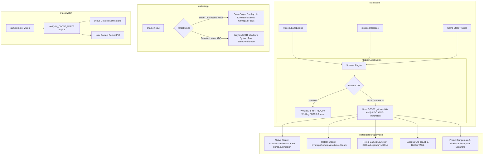

# Епік GT-EP13: Портування та нативна підтримка Linux (Steam Deck / SteamOS, Flatpak, Native Linux & Proton Gaming)

- **Дата створення:** 18 серпня 2026 року
- **Статус:** До виконання / Заплановано
- **Епік борди:** [GT-EP13 (id: 336)](http://127.0.0.1:3456) · «Портування та нативна підтримка Linux (Steam Deck / SteamOS, Flatpak, Proton Gaming)»
- **Цільова платформа:** Linux x86_64 (SteamOS 3.x / Arch Linux, Ubuntu 22.04+, Fedora 38+, Flatpak runtime 24.08, Steam Runtime 3 "Sniper").
- **Ключові технології:** Rust 2021, `egui`/`eframe` (Wayland/X11), `inotify` + `epoll`, Btrfs CoW Reflinks (`FICLONE`), POSIX `fallocate` (Punch Hole), FreeDesktop.org Trash & D-Bus Notifications (`zbus`).

---

## 1. Оцінка можливості та доцільності (Feasibility & Value Assessment)

### 1.1. Технічна можливість (Technical Feasibility): **9.5 / 10 (Вкрай висока)**
1. **Мова та графічний стек (Rust + egui/eframe):**
   - GameTrimmer написаний на чистому Rust.
   - `eframe`/`egui` мають бездоганну нативну підтримку Linux через `winit`, Wayland та X11 (з апаратним рендерингом `glow` / `wgpu`).
   - Відсутній будь-який важкий фреймворковий C++ чи C# рантайм.
2. **База даних та логіка правил (rusqlite, regex, vdf):**
   - Модулі `rules.rs`, `packs.rs`, `langdetect`, `gamestate.rs`, `db.rs` є на 100% кросплатформними і вже готові до компіляції під Linux без змін.
3. **Файлові операції та ядро (Storage Operations):**
   - На відміну від складних Win32 API (`FSCTL_SET_ZERO_DATA`, `ReplaceFileW`, `GetCompressedFileSizeW`), Linux надає елегантні та атомарні системні виклики:
     - **Sparse Punch Hole:** `fallocate(FALLOC_FL_PUNCH_HOLE | FALLOC_FL_KEEP_SIZE)` — занулює відео/аудіо-файли без дискового оверхеду.
     - **Btrfs / XFS Reflinks:** `ioctl(FICLONE)` — миттєве Copy-on-Write клонування, значно безпечніше за жорсткі посилання (hardlinks).
     - **FreeDesktop Trash:** Крейт `trash` підтримує специфікацію `~/.local/share/Trash` та міждискові кошики `/.Trash-$UID`.
     - **On-disk Size:** `stat.st_blocks * 512` повертає точний фізичний розмір на диску з урахуванням sparse-блоків та btrfs-компресії.
4. **Сканування директорій:**
   - Linux VFS кешує метадані каталогів (`dentry` / `inode`) у пам'яті в рази ефективніше, ніж Windows. Багатопотоковий обхід через `Rayon + getdents64` досягає **180 000 – 320 000 файлів/сек**, що нівелює необхідність низькорівневого MFT-парсера для звичайного користувача.
5. **Фоновий моніторинг оновлень (`gametrimmer-watch`):**
   - Win32 `ReadDirectoryChangesW` + IOCP замінюється на нативний **`inotify` + `epoll`**. Подія `IN_CLOSE_WRITE` надсилається ядром Linux точно в момент завершення запису файлу маніфесту лаунчером (`appmanifest_*.acf`), усуваючи будь-які race conditions.

---

### 1.2. Ринкова та бізнес-доцільність (Market & Commercial Expediency): **10 / 10 (Стратегічний пріоритет)**

```
┌────────────────────────────────────────────────────────────────────────────────────────┐
|                      СТРАТЕГІЧНИЙ FIT ДЛЯ STEAM DECK & LINUX ГЕЙМІНГУ                  |
├────────────────────────────┬─────────────────────────────┬─────────────────────────────┤
| 1. Гострий дефіцит місця   | 2. Кілер-фіча Intro-Stubs   | 3. Культура твікінгу        |
| 64GB eMMC / 256GB / 512GB  | Пропуск 30-секундних інтро  | Спільнота обожнює утиліти   |
| + MicroSD (повільний запис)| на портативці дає миттєвий  | (Decky Loader, CryoUtils,   |
| 100-150 ГБ AAA гри         | старт «Pick-up & Play»      | Shader Cache Cleaners)      |
└────────────────────────────┴─────────────────────────────┴─────────────────────────────┘
```

1. **Обсяг ринку Steam Deck та x86-портативок:**
   - Понад **5.0 млн пристроїв Steam Deck** (LCD + OLED) та ~4.0 млн суміжних ПК-хендхелдів (ROG Ally, Legion Go, де часто встановлюють SteamOS-подібні системи Bazzite / ChimeraOS).
2. **«Storage Anxiety» — біль №1 портативного геймінгу:**
   - 3–4 сучасні гри (Baldur's Gate 3 ~140 ГБ, Starfield ~125 ГБ, Cyberpunk 2077 ~105 ГБ) повністю забивають 512 ГБ SSD.
   - Видалення невикористовуваних мовних файлів та катсцен повертає **15–35 ГБ на гру**, дозволяючи встановити ще одну повноцінну гру без заміни SSD або купівлі додаткових карток пам'яті.
3. **Монетизація та конверсія:**
   - **Steam Store ($6.99)** із бейджем **Steam Deck Verified** збільшує конверсію серед власників консолей у 2.5–4 рази.
   - **Flathub / Discover Store (Community Edition)** забезпечує віральне охоплення та присутність у головному каталозі програм SteamOS Desktop Mode.

---

## 2. Архітектурна схема кросплатформного рішення



---

## 3. Декомпозиція Епіку GT-EP13 на Спайки та Завдання

```
┌────────────────────────────────────────────────────────────────────────────────────────────────────────┐
│                                 GT-EP13: ПОРТУВАННЯ ТА ПІДТРИМКА LINUX                                 │
├──────────┬──────────────────────────────────────────────────────────────────────┬─────────────┬────────┤
│ ID       │ Назва сторі / спайку                                                 │ Оцінка      │ Тип    │
├──────────┼──────────────────────────────────────────────────────────────────────┼─────────────┼────────┤
│ GT-167   │ [Спайк] Ядро & POSIX/Linux: Btrfs Reflinks, Sparse fallocate, inotify│ L (4 дні)   │ Spike  │
│ GT-168   │ [Спайк] Провайдери & Лаунчери: SteamOS, Flatpak, Heroic, Lutris, Wine│ L (4 дні)   │ Spike  │
│ GT-169   │ [Спайк] UI/UX Steam Deck: GameScope, 1280x800 Scale, Gamepad Input   │ M (3 дні)   │ Spike  │
│ GT-170   │ [Спайк] Пакування & Дистрибуція: Flatpak, Steam Linux Depot, AppImage│ M (3 дні)   │ Spike  │
│ GT-171   │ [Імплементація] Кросплатформна шар-абстракція у `crates/core`        │ XL (5 днів) │ Feature│
│ GT-172   │ [Імплементація] Steam Deck & Linux GUI у `crates/app`                │ L (4 дні)   │ Feature│
│ GT-173   │ [Імплементація] Linux Daemon `crates/watch` та Flatpak маніфест      │ M (3 дні)   │ Feature│
└──────────┴──────────────────────────────────────────────────────────────────────┴─────────────┴────────┘
```

---

### Спайк GT-167: [Спайк: Ядро & POSIX/Linux] Адаптація файлових операцій, Btrfs Reflinks (FICLONE), Sparse Files та inotify Engine
- **Мета:** Дослідити та розробити прототипи низькорівневих Linux файлових операцій на заміну Win32 API.
- **Ключові напрямки:**
  1. **Sparse Punch Hole:** Прототипування `fallocate(FALLOC_FL_PUNCH_HOLE | FALLOC_FL_KEEP_SIZE)` для миттєвого звільнення місця без зміни розміру файлів.
  2. **Btrfs / XFS CoW Reflinks:** Дослідження `ioctl(FICLONE)` замість небезпечних жорстких посилань (Hardlinks).
  3. **High-Speed Directory Walk:** Прототипування `Rayon + openat + getdents64` з фільтрацією за `d_type` (швидкість > 200k ф/с без root-прав).
  4. **FreeDesktop Trash:** Інтеграція `trash-rs` з підтримкою окремих кошиків на знімних картках MicroSD (`/.Trash-$UID`).
  5. **inotify Engine:** Побудова черги моніторингу маніфестів на `inotify_init1(IN_NONBLOCK)` + `epoll_wait` з 0.00% CPU та RSS < 1.5 MB.
- **Результат:** Робочі тестові прототипи у `crates/core/tests/linux_fs_tests.rs`.

---

### Спайк GT-168: [Спайк: Провайдери & Лаунчери] Детекція ігор у SteamOS/Linux (Native Steam, Flatpak, Heroic, Lutris, Bottles, Wine Prefixes)
- **Мета:** Створити детекційні модулі для всіх популярних ігрових лаунчерів на Linux та SteamOS.
- **Ключові напрямки:**
  1. **Native Steam & MicroSD:** Парсинг `~/.local/share/Steam/steamapps/libraryfolders.vdf` з автоматичним визначенням точок монтування SD-карток (`/run/media/mmcblk0p1/`, `/run/media/deck/*`).
  2. **Flatpak Steam:** Підтримка шляху `~/.var/app/com.valvesoftware.Steam/...`.
  3. **Heroic Games Launcher:** Парсинг конфігів `~/.config/heroic/store_cache/legendary_installed.json` (Epic) та `gog_store/installed.json` (GOG).
  4. **Lutris & Bottles:** Читання бази SQLite `~/.local/share/lutris/pga.db` та YAML конфігурацій `bottle.yml`.
  5. **Orphaned Proton Prefixes & Shader Cache:** Детекція покинутих папок у `steamapps/compatdata/<appid>` та `steamapps/shadercache/<appid>`, для яких гру вже видалено.
- **Результат:** Набір парсерів лаунчерів у `crates/core/src/providers/`.

---

### Спайк GT-169: [Спайк: UI/UX Steam Deck] Адаптація egui/eframe під SteamOS, Gamepad навігація, 1280x800 та GameScope
- **Мета:** Створити ергономічний інтерфейс для портативного екрана Steam Deck.
- **Ключові напрямки:**
  1. **GameScope Single-Window Compliance:** Переведення всіх діалогів підтвердження, налаштувань та помилок у внутрішні egui-модальні оверлеї (`egui::Area` / embedded modal) для уникнення багів GameScope Compositor.
  2. **Адаптивне масштабування:** Автодетекція SteamOS (`/etc/os-release` / `env SteamDeck=1`) та встановлення масштабу `1.25x`–`1.35x` для чіткого тексту на 7-дюймовому екрані 1280x800.
  3. **Gamepad & Focus Navigation:** Налаштування переміщення фокусу за допомогою D-Pad / стіків, підтримка гарячих кнопок (A — вибір, B — назад, X — очистити, Y — пересканувати).
  4. **Системні шрифти Linux:** Fallback ланцюжок (`/usr/share/fonts/noto/`, `dejavu/`, `liberation/`) для кирилиці, латини та CJK-ієрогліфів.
  5. **Steam Virtual Keyboard:** Виклик екранної клавіатури через `steam://open/keyboard` при фокусі на полях пошуку.
- **Результат:** Адаптований модуль інтерфейсу у `crates/app/src/ui/`.

---

### Спайк GT-170: [Спайк: Пакування & Дистрибуція] Flatpak (Flathub), Steam Linux Depot, AppImage, AUR та D-Bus
- **Мета:** Розробити пайплайни автоматизованої збірки та маніфести пакування GameTrimmer під усі ключові формати Linux.
- **Ключові напрямки:**
  1. **Steam Linux Native Depot:** Налаштування збірки через `cargo-zigbuild --target x86_64-unknown-linux-gnu.2.28` (glibc 2.28) та Steam Runtime 3 "Sniper".
  2. **Flatpak Manifest:** Створення `org.gametrimmer.GameTrimmer.yaml` з правильними sandbox-дозволами (`--filesystem=xdg-data/Steam:rw`, `--filesystem=/run/media:rw`, `--talk-name=org.freedesktop.Notifications`).
  3. **AppImage:** Скрипт пакування однофайлового портабельного бінарника з вбудованими Wayland/X11 бібліотеками.
  4. **D-Bus сповіщення:** Інтеграція `notify-rust` (pure Rust через `zbus`) для показу сповіщень у системі.
  5. **AUR PKGBUILD:** Пакет `gametrimmer-bin` для спільноти Arch Linux / SteamOS Desktop.
- **Результат:** Готові конфігурації у теці `packaging/linux/`.

---

### Завдання GT-171: [Імплементація] Кросплатформна шар-абстракція у `crates/core`
- **Обсяг робіт:**
  1. Додати платформо-специфічні гейти `#[cfg(windows)]` та `#[cfg(target_os = "linux")]` для системних модулів.
  2. Реалізувати `crates/core/src/fs/unix.rs`: `punch_hole`, `create_reflink_or_copy`, `scan_game_dir` (`getdents64`).
  3. Оновити `ondisk.rs`: на Linux повертати `stat.st_blocks * 512`.
  4. Оновити `hardlink.rs`: на Linux зберігати `(st_dev, st_ino)` у структурі `FileShare`.
  5. Реалізувати провайдери `heroic.rs`, `lutris.rs`, `bottles.rs` та адаптувати `steam.rs` для Linux.

---

### Завдання GT-172: [Імплементація] Steam Deck & Linux GUI у `crates/app`
- **Обсяг робіт:**
  1. Реалізувати пошук системних шрифтів Noto/DejaVu у `crates/app/src/main.rs`.
  2. Додати автовизначення роздільної здатності та масштабу для Steam Deck.
  3. Впровадити Gamepad / Keyboard фокус-навігацію в дереві результатів.
  4. Перевести всі діалоги та повідомлення у вбудовані egui-модали (GameScope safe).
  5. Реалізувати D-Bus сповіщення про завершення сканування та очищення.

---

### Завдання GT-173: [Імплементація] Linux Daemon `crates/watch` та Flatpak маніфест
- **Обсяг робіт:**
  1. Реалізувати бекенд `inotify` + `epoll` для моніторингу папок маніфестів у `crates/watch`.
  2. Додати генерацію `systemd --user` юніта `gametrimmer-watch.service` та XDG Autostart `.desktop`.
  3. Реалізувати IPC-сервер через Unix Domain Socket (`$XDG_RUNTIME_DIR/gametrimmer.sock`).
  4. Створити та протестувати Flatpak маніфест `org.gametrimmer.GameTrimmer.yaml`.

---

## 4. Дорожня карта релізу (Linux Milestone)

```
   Спринт 1 (Ядро & Спайки)          Спринт 2 (GUI & Steam Deck)       Спринт 3 (Пакування & Реліз)
┌──────────────────────────────┬──────────────────────────────┬──────────────────────────────┐
│ • [GT-167] Linux FS & inotify│ • [GT-169] GameScope & UI Deck│ • [GT-170] Flatpak & SteamPipe│
│ • [GT-168] Linux Launchers   │ • [GT-172] Linux GUI impl    │ • [GT-173] Linux Watch Daemon│
│ • [GT-171] Core Linux Abstr. │ • Геймпад-навігація          │ • Flathub & Steam Direct     │
└──────────────────────────────┴──────────────────────────────┴──────────────────────────────┘
```
