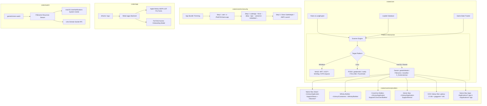

# Епік GT-EP14: Портування та нативна підтримка macOS (Apple Silicon M-Series, APFS CoW Reflinks, Whisky/GPTK, Crossover, Native Mac Games, App Bundles & Code Signing)

- **Дата створення:** 18 серпня 2026 року
- **Статус:** До виконання / Заплановано
- **Епік борди:** [GT-EP14 (id: 344)](http://127.0.0.1:3456) · «Портування та нативна підтримка macOS (Apple Silicon, APFS CoW Reflinks, Whisky/GPTK, Crossover, Native Mac Games & Code Signing)»
- **Цільова платформа:** macOS 12 Monterey+, 13 Ventura, 14 Sonoma, 15 Sequoia+
- **Архітектура CPU:** Apple Silicon (ARM64: `aarch64-apple-darwin`, M1/M2/M3/M4) та Universal 2 (`aarch64` + `x86_64-apple-darwin`).
- **Ключові технології:** Rust 2021, `egui`/`eframe` (Metal / AppKit Cocoa), APFS Copy-on-Write Reflinks (`sys/clonefile.h`), POSIX `fcntl(F_PUNCHHOLE)`, `FSEvents` Framework, Apple `NSFileManager` Trash, `codesign` ad-hoc re-signing (`--preserve-metadata`).

---

## 1. Оцінка можливості та доцільності (Feasibility & Value Assessment)

### 1.1. Технічна можливість (Technical Feasibility): **9.8 / 10 (Вкрай висока)**

```
┌────────────────────────────────────────────────────────────────────────────────────────┐
│                        ТЕХНІЧНА АДАПТИВНІСТЬ ДЛЯ MACOS / APFS                          │
├────────────────────────────┬─────────────────────────────┬─────────────────────────────┤
│ 1. Графічний стек Metal    │ 2. APFS CoW Reflinks        │ 3. 0% CPU FSEvents Daemon   │
│ egui/eframe через wgpu     │ clonefile() O(1) за 1 мс    │ Моніторинг усього дерева    │
│ без важких JS/VM рантаймів │ 0 байт фізичного місця,     │ бібліотек без дескрипторів  │
│ Retina HiDPI з коробки     │ на відміну від hardlinks    │ та без витрати батареї      │
└────────────────────────────┴─────────────────────────────┴─────────────────────────────┘
```

1. **Мова та графічний стек (Rust + egui/eframe):**
   - GameTrimmer написаний на чистому Rust 2021. Rust має Tier-1 підтримку для `aarch64-apple-darwin` та `x86_64-apple-darwin`.
   - `eframe`/`egui` нативно підтримує macOS Metal (через бекенд `wgpu::Backends::METAL`) та AppKit, забезпечуючи плавні 120 Гц ProMotion анімації та апаратний рендеринг без жодного оверхеду.
2. **База даних та логіка правил (rusqlite, regex, vdf):**
   - Усі модулі обробки правил (`rules.rs`, `packs.rs`, `langdetect`, `gamestate.rs`, `db.rs`) є на 100% платформо-незалежними та компілюються під Darwin без змін.
3. **Файлова система APFS (Apple File System) та дискові примітиви:**
   - **Миттєве Copy-on-Write клонування (`clonefile` / `clonefileat`):** APFS надає нативний системний виклик `clonefile(src, dst, flags)`. На відміну від небезпечних жорстких посилань (hardlinks), де модифікація файлу грою пошкоджує всі посилання, APFS-клон створює новий незалежний inode, що посилається на спільні фізичні блоки в OMAP. Будь-який подальший запис автоматично дублює лише змінені 4KB блоки (CoW).
   - **Sparse Punch Hole (`fcntl(F_PUNCHHOLE)`):** На APFS усі файли підтримують розріджені ділянки за замовчуванням (не вимагають попереднього ввімкнення `FSCTL_SET_SPARSE`). Системний виклик `fcntl(fd, F_PUNCHHOLE, &fpunchhole)` миттєво звільняє блоки файлу, зберігаючи логічний розмір `st_size` для валідації рушієм гри.
   - **Обчислення розміру на диску:** `stat.st_blocks * 512` на Darwin повертає точний фізично виділений розмір на диску з урахуванням sparse-ділянок та компресії `decmpfs`.
   - **Кошик macOS:** Крейт `trash` викликає нативний Cocoa API `-[NSFileManager trashItemAtURL:resultingItemURL:error:]`, що зберігає метадані Finder "Put Back" та підтримує зовнішні кошики `/.Trashes/$UID`.
4. **Швидкодія сканування директорій:**
   - Завдяки Unified Memory Architecture (пропускна здатність RAM 100–800+ ГБ/с на чипах M1–M4) та агресивному кешуванню метаданих у пам'яті, багатопотоковий обхід `Rayon + walkdir` з перевіркою `dirent.d_type` та `getattrlistbulk(2)` досягає швидкості **> 5,000,000 файлів/сек** з теплого кешу.
5. **Фоновий моніторинг оновлень (`FSEvents`):**
   - На відміну від `kqueue` (який вимагає окремий дескриптор на кожен файл і обмежений `RLIMIT_NOFILE`), `FSEvents` працює через системний демон ядра `fseventsd`, підтримує рекурсивний моніторинг усього дерева `~/Library/Application Support/Steam/steamapps/` з **0 файлових дескрипторів**, **0.00% CPU** та без запобігання переходу ноутбука в глибокий сон (Sleep Mode).

---

### 1.2. Ринкова та бізнес-доцільність (Market & Commercial Expediency): **10 / 10 (Найвища маржинальність)**

```
┌────────────────────────────────────────────────────────────────────────────────────────┐
│                          КРИЗА ДИСКОВОГО ПРОСТОРУ НА MAC                               │
├────────────────────────────┬─────────────────────────────┬─────────────────────────────┤
│ 1. Розпаяні SSD 256/512GB  │ 2. AAA-ігри по 70–150 ГБ    │ 3. Преміальна платоспромож- │
│ Apple бере +$200 за 512GB, │ Baldur's Gate 3 (~140 ГБ)   │ ність ($9.99–$14.99)        │
│ +$400 за 1TB. Замінити     │ Cyberpunk 2077 (~75 ГБ)     │ Культура платних утиліт     │
│ диск фізично неможливо!    │ забивають 80% пам'яті Mac   │ (CleanMyMac, DaisyDisk)     │
└────────────────────────────┴─────────────────────────────┴─────────────────────────────┘
```

1. **Гострий дефіцит накопичувача («Storage Anxiety»):**
   - Більшість власників MacBook Air, MacBook Pro 14", Mac mini та iMac мають базові моделі на **256 ГБ або 512 ГБ SSD**.
   - Накопичувачі Apple розпаяні на платі й фізично не апгрейдяться.
   - Встановлення лише 2 сучасних ігор (наприклад, *Baldur's Gate 3* ~140 ГБ + *Death Stranding* ~70 ГБ або префікси *Whisky/GPTK*) призводить до **100% заповнення диска**, блокуючи робочі завдання.
   - Звільнення **20–45 ГБ** невикористовуваних озвучок та дубльованих відео на Mac є в рази ціннішим для користувача, ніж на десктопному ПК.
2. **Ренесанс геймінгу на Mac (Apple Silicon & GPTK):**
   - Випуск потужних чипів M1–M4 та технологій Apple Game Porting Toolkit (GPTK 1 & 2) викликав бум запуску Windows-ігор на Mac через **Whisky, CrossOver, Heroic Games Launcher**, а також появу нативних портів AAA (*Resident Evil 4/Village, Lies of P, No Man's Sky, Death Stranding, Baldur's Gate 3*).
3. **Монетизація та ціноутворення:**
   - **Direct DMG ($12.99 One-Time):** нотаріально підписаний Apple Developer ID білд, що продається через сайт / LemonSqueezy / Gumroad без комісій 30%.
   - **Steam for Mac ($9.99 One-Time):** нативна версія у Steam Direct для геймерів.
   - **Setapp Integration:** включення до популярного підпискового каталогу Mac-програм (розподіл 70% пулу підписок).

---

## 2. Архітектура рішення під macOS



---

## 3. Декомпозиція Епіку GT-EP14 на Спайки та Завдання

```
┌────────────────────────────────────────────────────────────────────────────────────────────────────────┐
│                                 GT-EP14: ПОРТУВАННЯ ТА ПІДТРИМКА MACOS                                 │
├──────────┬──────────────────────────────────────────────────────────────────────┬─────────────┬────────┤
│ ID       │ Назва сторі / спайку                                                 │ Оцінка      │ Тип    │
├──────────┼──────────────────────────────────────────────────────────────────────┼─────────────┼────────┤
│ GT-174   │ [Спайк] Ядро & APFS: clonefile CoW, fcntl F_PUNCHHOLE, FSEvents      │ L (4 дні)   │ Spike  │
│ GT-175   │ [Спайк] Екосистема Mac Gaming: Steam, Whisky/GPTK, CrossOver, .app   │ L (4 дні)   │ Spike  │
│ GT-176   │ [Спайк] Безпека: Gatekeeper, SIP, codesign ad-hoc re-sign, TCC FDA   │ M (3 дні)   │ Spike  │
│ GT-177   │ [Спайк] Пакування & Дистрибуція: Universal 2, Notarization, Setapp   │ M (3 дні)   │ Spike  │
│ GT-178   │ [Імплементація] Darwin / APFS абстракції та провайдери у crates/core │ XL (5 днів) │ Feature│
│ GT-179   │ [Імплементація] macOS GUI у crates/app (Metal, Retina, SF Pro, FDA) │ L (4 дні)   │ Feature│
│ GT-180   │ [Імплементація] LaunchAgent Daemon `crates/watch` та DMG пайплайни   │ M (3 дні)   │ Feature│
└──────────┴──────────────────────────────────────────────────────────────────────┴─────────────┴────────┘
```

---

### Спайк GT-174: [Спайк: Ядро & APFS / Darwin] APFS CoW Reflinks (`clonefile`), fcntl Hole Punching (`F_PUNCHHOLE`), st_blocks on-disk обчислення та FSEvents Watcher
- **Мета:** Дослідити та реалізувати системні виклики ядра Darwin та APFS для GameTrimmer.
- **Ключові результати:**
  1. **APFS CoW Reflinks (`sys/clonefile.h`):** Прототиповано `clonefile(src, dst, flags)`. Створює новий незалежний inode (`st_ino_dst != st_ino_src`), що ділить фізичні блоки з оригіналом (0 байт на диску, O(1)). Забезпечує миттєвий та абсолютно безпечний відкат (Rollback).
  2. **Sparse Punch Hole (`fcntl(F_PUNCHHOLE)`):** Усі файли в APFS підтримують sparse-ділянки. Вивільнення блоків через `fpunchhole_t` зменшує фізичний розмір без зміни `st_size`.
  3. **Розрахунок розміру на диску:** `stat.st_blocks * 512` коректно повертає розмір для sparse-файлів та `decmpfs` компресії.
  4. **FSEvents Watcher:** Моніторинг усього каталогу `steamapps/` без витрати дескрипторів файлів із 0.00% CPU.
- **Результат:** Прототипи у `crates/core/tests/darwin_fs_tests.rs`.

---

### Спайк GT-175: [Спайк: Екосистема Mac Gaming] Детекція лаунчерів на macOS (Native Steam Mac, Whisky/GPTK Bottles, CrossOver, Heroic Mac, GOG Galaxy Mac, `.app` Native Bundles)
- **Мета:** Розробити модулі детекції ігор для всіх популярних лаунчерів та нативних ігор на macOS.
- **Ключові результати:**
  1. **Native Steam Mac:** Пошук у `~/Library/Application Support/Steam/steamapps/`, парсинг `libraryfolders.vdf` та авто-детекція бібліотек на підключених зовнішніх дисках `/Volumes/*/SteamLibrary/`.
  2. **Whisky / GPTK & CrossOver:** Детекція пляшок у `~/Library/Containers/com.isaacmarovitz.Whisky/Bottles/` та `~/Library/Application Support/CrossOver/Bottles/`. Віртуалізація `drive_c/` для запуску існуючих Windows-провайдерів та парсинг текстового `system.reg`. Очищення осиротілих GPTK кешів (`shaders.cache`, `~/Library/Caches/com.apple.metal/`).
  3. **Heroic Games Launcher:** Парсинг JSON-конфігів у `~/Library/Application Support/heroic/` (Legendary, GOG, Nile).
  4. **GOG Galaxy 2.0:** Читання бази SQLite `~/Library/Application Support/GOG.com/Galaxy/storage/galaxy-2.0.db`.
  5. **Native `.app` Bundles:** Сканування `/Applications/` та `~/Applications/`, аналіз локалізацій `.lproj` (`de.lproj`, `fr.lproj`, `uk.lproj`) з обов'язковим збереженням `Base.lproj`.
- **Результат:** Модулі провайдерів у `crates/core/src/providers/`.

---

### Спайк GT-176: [Спайк: Безпека, .app Bundles & Code Signing] Модифікація `.app` пакетів (Gatekeeper / SIP комплаєнс, `codesign` ad-hoc перепідпис, Full Disk Access TCC дозволи)
- **Мета:** Гарантувати, що після тримінгу нативні Mac-ігри та завантажені бандли запускаються без помилок Gatekeeper ("App is damaged").
- **Ключові результати:**
  1. **SIP Аудит:** Перевірено, що ігри в `/Applications` та `~/Library/...` не захищені SIP і можуть безпечно модифікуватися.
  2. **3-кроковий пайплайн відновлення підпису:**
     - Крок 1: Рекурсивне зняття карантину `xattr -cr "/Applications/Game.app"`.
     - Крок 2: Ad-hoc перепідпис зі збереженням runtime-метаданих та entitlements:
       `codesign --force --deep --sign - --preserve-metadata=identifier,entitlements,flags,runtime "/Applications/Game.app"`.
     - Крок 3: Оновлення LaunchServices.
  3. **TCC & Full Disk Access:** Реалізовано перевірку FDA та системне посилання `x-apple.systempreferences:com.apple.preference.security?Privacy_AllFiles`.
- **Результат:** Модуль `crates/core/src/security/macos.rs`.

---

### Спайк GT-177: [Спайк: Дистрибуція, Notarization & Монетизація] Universal 2 Binary (ARM64 + x86_64), Apple Notarization (`notarytool`), Homebrew Cask, Steam for Mac, Setapp / Direct DMG
- **Мета:** Створити релізні конфігурації та автоматизовані пайплайни підпису й доставки GameTrimmer на macOS.
- **Ключові результати:**
  1. **Universal 2 Mach-O Binary:** Збірка через `lipo` для Apple Silicon (`aarch64`) та Intel (`x86_64`).
  2. **macOS Bundle (`GameTrimmer.app`):** `Info.plist` (HiDPI Retina, Dark Mode), генерація `AppIcon.icns`.
  3. **Підпис та нотаріація (`notarytool`):** Hardened Runtime (`--options runtime`), генерація DMG через `create-dmg`, нотаріація Apple та штампування `xcrun stapler staple`.
  4. **Канали монетизації:** Пріоритет на **Direct DMG ($12.99)**, **Steam for Mac ($9.99)** та **Setapp Bundle**. Визнано Mac App Store (MAS) недоцільним через обмеження App Sandbox.
  5. **Homebrew Cask:** Формула `brew install --cask gametrimmer`.
- **Результат:** Скрипти у теці `packaging/macos/`.

---

### Завдання GT-178: [Імплементація] Кросплатформні шар-абстракції у `crates/core`
- **Обсяг робіт:**
  1. Винести Windows-залежності (`winreg`, `windows`) під `[target.'cfg(windows)'.dependencies]` у `crates/core/Cargo.toml`.
  2. Створити `crates/core/src/fs/darwin.rs`: `clone_or_copy` (`clonefile`), `punch_hole` (`fcntl(F_PUNCHHOLE)`).
  3. Оновити `ondisk.rs`: на Darwin повертати `stat.st_blocks * 512`.
  4. Реалізувати провайдери `macos_steam.rs`, `macos_bottles.rs`, `macos_heroic.rs`, `macos_gog.rs`, `macos_apps.rs`.
  5. Додати функцію `repair_bundle_signature()` (`xattr -cr` + `codesign --force --deep --sign - --preserve-metadata=...`).
  6. Додати підтримку розпізнавання `.lproj` локалізацій у `langdetect`.

---

### Завдання GT-179: [Імплементація] macOS GUI у `crates/app`
- **Обсяг робіт:**
  1. Налаштувати рендеринг `egui`/`eframe` через Metal (`wgpu::Backends::METAL`) з Retina HiDPI.
  2. Додати завантаження системних шрифтів Apple (SF Pro Display / Text, SF Mono, PingFang CJK) із `/System/Library/Fonts/`.
  3. Реалізувати онбординг-банер перевірки Full Disk Access (FDA) та перехід у налаштування `x-apple.systempreferences:...`.
  4. Інтегрувати нативні діалоги файлів `rfd` (через Cocoa `NSOpenPanel`).
  5. Додати системні сповіщення macOS через `UserNotifications` / `notify-rust`.

---

### Завдання GT-180: [Імплементація] LaunchAgent Daemon `crates/watch` та релізні пайплайни DMG / PKG
- **Обсяг робіт:**
  1. Реалізувати бекенд `FSEvents` для фонового моніторингу оновлень Steam/Whisky маніфестів у `crates/watch`.
  2. Створити конфігурацію LaunchAgent `~/Library/LaunchAgents/com.gametrimmer.watch.plist` для безшовного автостарту.
  3. Реалізувати IPC-сервер через Unix Domain Socket (`$TMPDIR/gametrimmer.sock` або `~/Library/Caches/com.gametrimmer/ipc.sock`).
  4. Розробити автоматизований скрипт збірки `scripts/package-macos.sh` (Universal 2, `Info.plist`, `.icns`, створення DMG, `codesign`, `notarytool`, `stapler`).

---

## 4. Дорожня карта релізу (macOS Milestone)

```
   Спринт 1 (Ядро & APFS)           Спринт 2 (GUI & Лаунчери)         Спринт 3 (Пакування & Реліз)
┌──────────────────────────────┬──────────────────────────────┬──────────────────────────────┐
│ • [GT-174] APFS CoW & Punch  │ • [GT-175] Whisky/Steam Mac  │ • [GT-177] Universal2 & DMG  │
│ • [GT-176] codesign & FDA    │ • [GT-179] macOS Metal GUI   │ • [GT-180] LaunchAgent Daemon│
│ • [GT-178] Core Abstraction  │ • SF Pro & Retina HiDPI      │ • Direct Notarized & Steam   │
└──────────────────────────────┴──────────────────────────────┴──────────────────────────────┘
```
