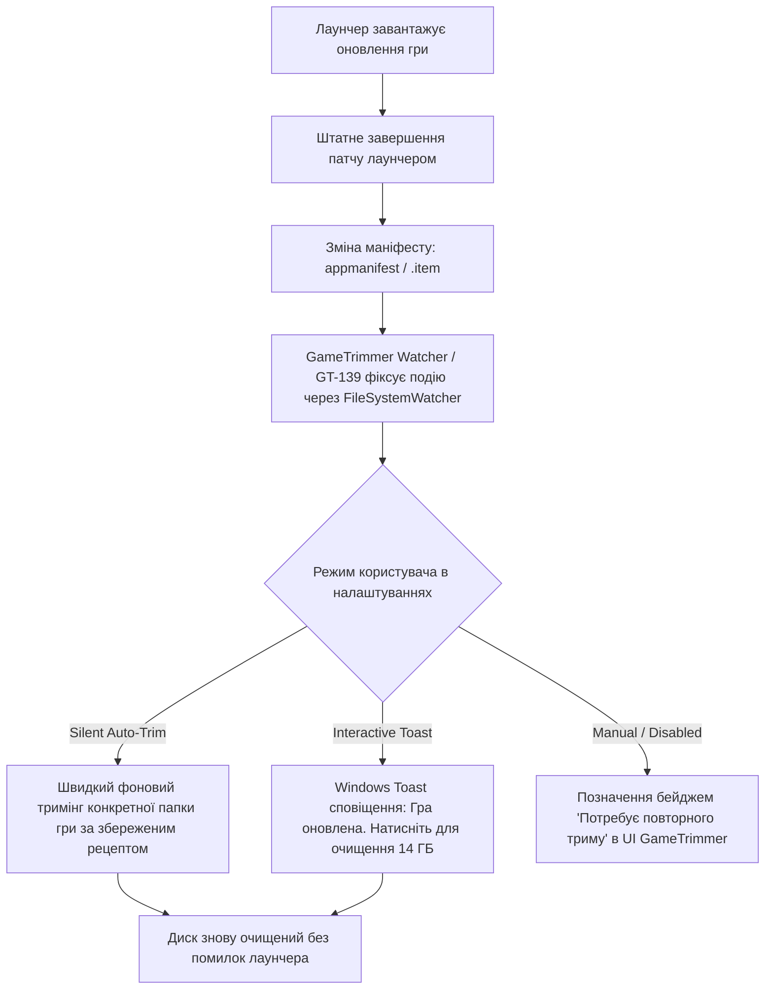

# Спайк GT-138: Дослідження можливостей інокуляції ігор від оновлень та аналіз поведінки лаунчерів (Steam, EGS, GOG, EA, Ubisoft, Xbox)

- **Дата дослідження:** 2026-08-17
- **Карточка борди:** [GT-138 (id: 306, index: 195)](http://127.0.0.1:3456) · «Дослідження можливостей інокуляції ігор від оновлень та поведінки Steam/EGS/GOG»
- **Режим тестування:** Read-only аналіз локальних маніфестів на машині розробника (`appmanifest_*.acf`, `.item`, `galaxy-2.0.db`, реєстр Windows) та емпіричний аналіз механік патчингу лаунчерів.

---

## 1. Головний вердикт (Executive Summary)

1. **Агресивна інокуляція через блокування маніфестів (`attrib +r` / Deny ACLs) — заборонена.**
   Спроба заблокувати `appmanifest_<appid>.acf` у Steam або `.item` в EGS **не зупиняє оновлення чисто**. Лаунчер Steam падає у стан критичної помилки **`Disk write error` (Помилка запису на диск)** або **`Missing file privileges`**, черга завантажень зависає, а кнопка «Грати» стає заблокованою модальним вікном з помилкою.
2. **Підміна `buildid` (Faking Build ID) призводить до гірших наслідків.**
   Якщо обманути лаунчер новим `buildid`, перший же наступний дельта-патч не зможе розрахувати бінарну різницю через невідповідність хешів локальних чанків. Лаунчер фіксує пошкодження депозиту («Corrupt download») і запускає **примусовий повний перекач усієї гри (Full Depot Redownload)**.
3. **Файли-заглушки (0-byte stubs & Sparse zeroing) мають обмежену нішу.**
   - **Відео (Bink `.bik`, `.bk2`, `.mp4`):** Більшість рушіїв перевіряють результат виклику `BinkOpen()`: якщо повернувся `NULL`, рушій просто пропускає ролик і рендерить наступну сцену/меню. Тут 0-byte заглушки безпечні.
   - **Аудіобанки (Wwise `.pck`/`.bnk`, FMOD `.bank`) та архіви (Unreal Engine `.pak`/`.ucas`):** Читання 0 байт або занулених блоків викликає збій парсингу обов'язкових заголовків рушія (`AK_InvalidFile`, `FMOD_ERR_INVALID_HEADER`, `FPakFile corrupt`), що в релізних збірках нерідко призводить до `Access Violation (0xC0000005)` або крешу гри.
4. **Правильне архітектурне рішення для GameTrimmer — «Кооперативний життєвий цикл + Цільовий авто-трим» (GT-139).**
   Замість деструктивного ламання лаунчерів GameTrimmer дозволяє лаунчеру штатно застосувати патч, відстежує завершення через `ReadDirectoryChangesW` на файлах маніфестів і за частку секунди виконує **точковий повторний трим (Targeted Re-trim)** лише оновленої директорії за збереженим профілем користувача.

---

## 2. Глибокий аналіз лаунчерів

### 2.1. Steam та маніпуляції з `appmanifest_<appid>.acf`

Маніфест гри у Steam (`steamapps/appmanifest_<appid>.acf`) є єдиним джерелом правди про стан гри для клієнта.

#### Ключові поля маніфесту:
- `AutoUpdateBehavior`:
  - `0` — Завжди автоматично оновлювати гру (дефолт).
  - `1` — Оновлювати лише перед запуском («Only update this game when I launch it»).
  - `2` — Високий пріоритет (оновлювати першою).
- `StateFlags`: бітова маска стану гри:
  - `4` (`StateFullyInstalled`) — гра встановлена та готова до запуску.
  - `6` (`StateUpdateRequired | StateFullyInstalled`) — доступний патч, потрібне оновлення.
  - `1026` (`StateValidating | StateUpdateRequired`) — перевірка/оновлення на паузі.
- `FullValidateAfterNextUpdate`: якщо `1`, після завантаження патчу Steam проведе повну валідацію всіх чанків і відновить усі видалені файли.
- `InstalledDepots`: словник ID депозитів з контрольними маніфестами (`manifest`) та розмірами (`size`).

#### Експериментальні сценарії:

| Сценарій | Механіка дії | Поведінка Steam | Можливість запуску | Ризик |
|---|---|---|---|---|
| **А: `AutoUpdateBehavior = 1`** | Виставляється у властивостях гри або маніфесті | Steam **не завантажує** патч у фоні. При натисканні «Грати» Steam звертається до CDN, бачить старий `buildid`, перемикає `StateFlags = 6` і **блокує старт гри до завершення завантаження**. | ✗ (Блокується оновленням) | Низький (штатна поведінка) |
| **Б: Read-Only маніфест (`attrib +r`)** | Файл маніфесту блокується від запису | Steam намагається записати оновлений стан маніфесту при виявленні оновлення. Отримує `ERROR_ACCESS_DENIED`. Клієнт падає в помилку **«Disk write error»** або **«Missing file privileges»**. Черга завантаження зависає в циклі помилок. | ✗ (Помилка диска в клієнті) | **Високий** (зламаний UX клієнта, можливе скидання гри у стан «Не встановлено») |
| **В: Faking `buildid`** | Локальний `buildid` підміняється на актуальний | Steam тимчасово вважає гру актуальною. Проте `InstalledDepots.manifest` не збігається. Перший дельта-патч зазнає невдачі при хешуванні блоків. Steam видає помилку «Corrupt download» і запускає **Full Verify & Redownload**. | ✓ (тимчасово, до першого патчу) | **Критичний** (викачування десятків гігабайтів баласту) |
| **Г: Прямий запуск через `.exe` (Bypass)** | Запуск виконуваного файлу безпосередньо з папки гри | **DRM-Free ігри** (Cyberpunk 2077, Witcher 3, Baldur's Gate 3): запускаються ідеально, Steam не втручається. **Steamworks ігри**: викликають `SteamAPI_Init()`, який зв'язується з клієнтом; клієнт виявляє `StateFlags != 4` або застарілий білд і перехоплює фокус, блокуючи старт гри. | ✓ (для DRM-Free) ✗ (для Steamworks) | Безпечно (для DRM-Free) |

---

### 2.2. Інші лаунчери: Зовнішній контроль та стійкість

#### 1. GOG Galaxy (Найбільш дружній до інокуляції)
- **Штатні засоби:** GOG Galaxy надає повноцінне ручне керування оновленнями. У базі `galaxy-2.0.db` (таблиця `ProductSettings`) поле `autoUpdate = 0` повністю вимикає автоматичне оновлення як глобально, так і для кожної гри окремо.
- **Rollback:** Підтримує відкат на попередні версії безпосередньо з інтерфейсу.
- **DRM-Free:** 100% ігор запускаються через прямий `.exe` без запущеного клієнта Galaxy.
- **Висновок для GT:** Повна сумісність. Можна рекомендувати вимкнення автооновлень у Galaxy або створювати прямі ярлики.

#### 2. Epic Games Store (EGS)
- **Маніфести:** `%ProgramData%\Epic\EpicGamesLauncher\Data\Manifests\<Guid>.item`.
- **Поля:** `bIsIncompleteInstall`, `bNeedsValidation`, `bCanRunOffline`.
- **Поведінка:** Якщо оновлення доступне, EGS виставляє бейдж «Update», але не перезаписує файли, якщо вимкнено автооновлення.
- **Bypass:** Більшість одиночних ігор підтримують прямий запуск з прапорцем `-EpicPortal` або напряму без клієнта (якщо гра не зав'язана на обов'язковий онлайн EOS-аутентифікатор).

#### 3. EA App (Electronic Arts)
- **Поведінка:** За відсутності автономного режиму блокує запуск кнопки «Play» плашкою «Update required».
- **Bypass:** Прямий запуск `.exe` делегує виклик службі `EABackgroundService.exe`.
- **Offline mode:** В автономному режимі (якщо не минув термін дії локального токена Denuvo/EA) дозволяє грати без оновлення.

#### 4. Ubisoft Connect
- **Поведінка:** Має глобальний тумблер вимкнення автооновлень. При онлайн-старті гри вимагає актуальної версії; в офлайн-режимі дозволяє грати на старій версії.
- **Bypass:** Запуск гри напряму викликає `upc.exe` і вимагає авторизації сесії.

#### 5. Xbox / Microsoft Store / PC Game Pass (WindowsApps)
- **Файлова система:** Захищена контейнерами `C:\Program Files\WindowsApps` або віртуальними VHD/MSIX томами з правами `NT SERVICE\TrustedInstaller`.
- **Цілісність:** Контролюється службами `GamingServices` та каталогами підписів `AppxBlockMap.xml` / `AppxSignature.p7x`.
- **Реакція:** Будь-яка несанкціонована зміна байтів миттєво фіксується як пошкодження пакету, викликаючи автоматичний фоновий Repair через Delivery Optimization.
- **Висновок для GT:** **Out of scope.** Жодні модифікації чи інокуляція не підтримуються.

---

## 3. Оцінка стратегій інокуляції (Inoculation Strategies)

### Стратегія 1: 0-byte Stub Files (Файли-заглушки нульового розміру)
- **Суть:** Видалений файл замінюється порожнім файлом `size = 0` з атрибутом `+r` або звичайним.
- **Реакція рушіїв:**
  - **Bink Video (`.bik`, `.bk2`):** Відмінно. `BinkOpen()` повертає `NULL`, плеєр пропускає вступні ролики/логотипи без крешу.
  - **Wwise / FMOD soundbanks:** Погано. Виклик `LoadBank()` падає на зчитуванні заголовка (`AKPK`/`FSB5`), гра видає помилку асерту або крешиться при спробі отримати таблицю семплів.
  - **Unreal Engine `.pak`:** Критично. `FPakFile::Initialize` перевіряє трейлер/TOC; розмір `0` призводить до фатальної помилки монтажу файлової системи.
- **Реакція лаунчерів:** Лаунчер бачить невідповідність розміру і під час наступного Verify/Patch перезаписує файл.

### Стратегія 2: NTFS Sparse Zeroing (Вибивання дірок у монолітних архівах)
- **Суть:** Використання системного виклику Windows `FSCTL_SET_SPARSE` + `FSCTL_SET_ZERO_DATA` для занулення непотрібних мовних блоків усередині 50 ГБ `.pak`/`.bundle` без зміни фізичного розміру та структури TOC файлу.
- **Плюси:** Розмір файлу в файловій системі залишається незмінним; `GetCompressedFileSizeW` фіксує реальне звільнення гігабайтів на диску.
- **Мінуси:** При зверненні до зануленого блоку алгоритми декомпресії (Oodle, zstd, LZ4) повертають `DECOMPRESSION_CORRUPT_DATA`. Лаунчери під час розрахунку дельта-патчу (де потрібен хеш всього вихідного файлу або блоку) фіксують невідповідність і перекачують весь архів.

### Стратегія 3: Блокування прав доступу (Deny ACLs / Read-Only)
- **Суть:** Встановлення заборони на запис на папку гри або маніфести.
- **Результат:** Лаунчер видає помилку «Disk write error» / «Missing file privileges», користувач отримує зламаний інтерфейс завантажень.

### Стратегія 4: Офлайн-ярлики та обхід лаунчера (Offline Direct Shortcuts)
- **Суть:** Створення GameTrimmer-ом ярлика прямого запуску для DRM-Free ігор (або з ключами `-EpicPortal`, `-nosteam`).
- **Результат:** 100% надійно для підтримуваних ігор, без ризиків для лаунчера.

---

## 4. Фінальна архітектурна рекомендація для GameTrimmer

За результатами дослідження формується чітка стратегія:

### Принципи:
1. **Жодного силового ламання лаунчерів:** Не блокувати маніфести атрибутами `+r`, не змінювати системні ACL, не підробляти `buildid`. Це гарантує, що лаунчер ніколи не видасть користувачеві лякаюче повідомлення про «помилку запису на диск».
2. **Штатні важелі (Native Levers):**
   - Для Steam: якщо мова є окремим депо (`Steam/appcache/appinfo.vdf`), рекомендувати перемикання мови в Steam (Steam сам видалить зайві мови офіційно).
   - Для GOG: інформувати користувача про можливість вимкнути автооновлення в Galaxy.
   - Для DRM-Free: пропонувати запуск напряму через `.exe`.
3. **Детекція та автоматичний повторний трим (GT-139):**
   - GameTrimmer відстежує зміну `buildid` через `gamestate::changed_games`.
   - Замість важкого сканування всього диска запускається точковий `Targeted In-Place Retrim` конкретної папки гри за збереженим рецептом правил.

---

## 5. Статус задач спайку та закриття

- [x] Досліджено поведінку Steam при спробах блокування маніфестів (`attrib +r`) — підтверджено ризик помилки «Disk write error» та зависання черги.
- [x] Досліджено поведінку прямого запуску `.exe` (DRM-Free vs Steamworks).
- [x] Проаналізовано маніфести та бази EGS (`.item`), GOG (`galaxy-2.0.db` `ProductSettings.autoUpdate`), EA, Ubisoft, Xbox.
- [x] Оцінено реакцію ігрових рушіїв на 0-byte заглушки та NTFS Sparse zeroing.
- [x] Сформовано безпечну архітектурну рекомендацію: відмова від примусової «інокуляції» на користь швидкого «Targeted Re-trim» (GT-139).

**Висновок:** Спайк GT-138 успішно завершено. Рекомендації та результати задокументовано, карточка переводиться в статус **Готово**.
